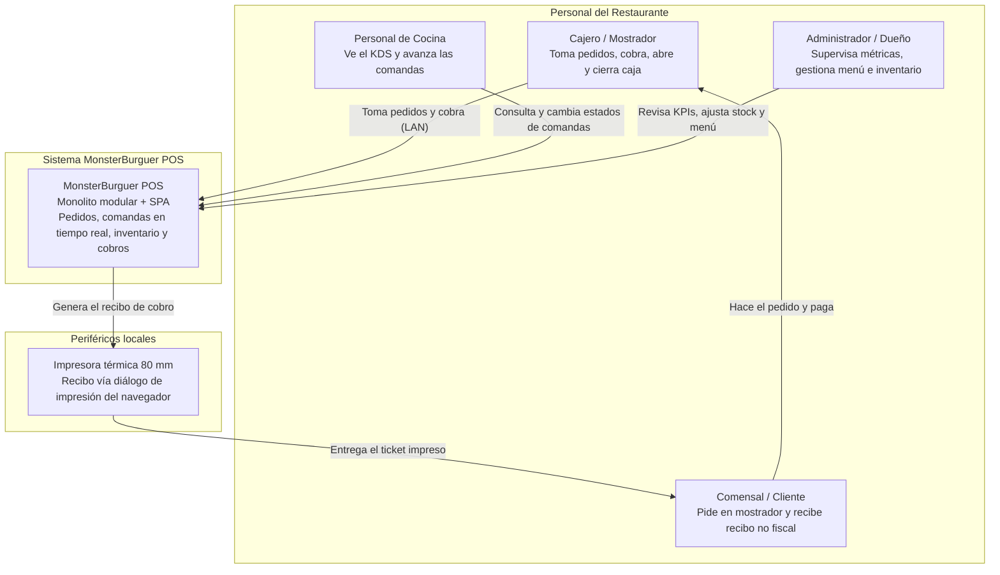
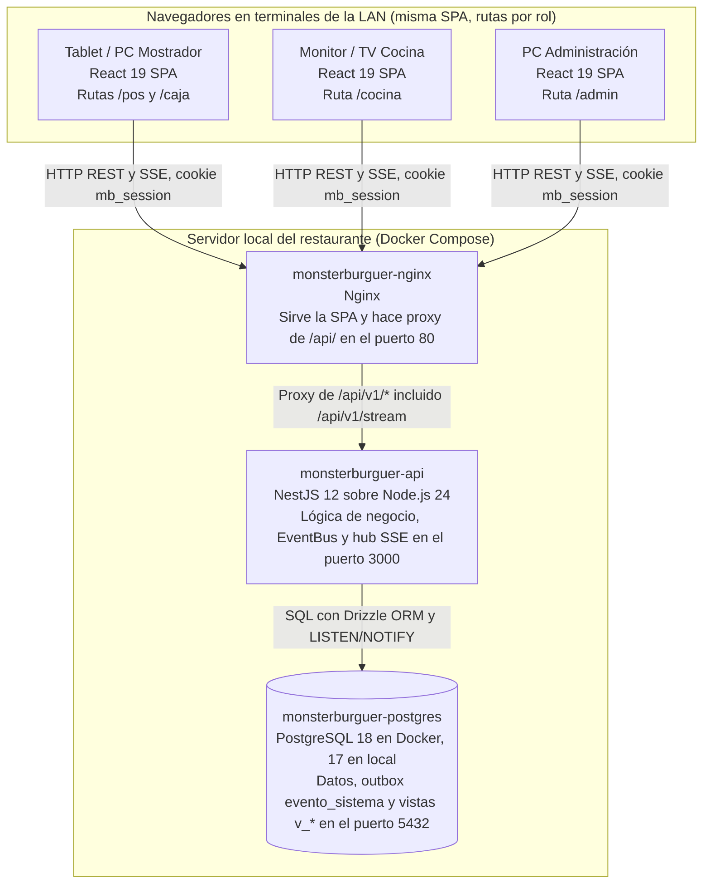
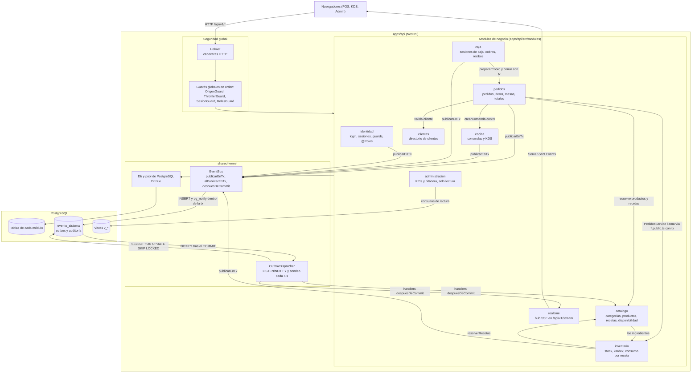
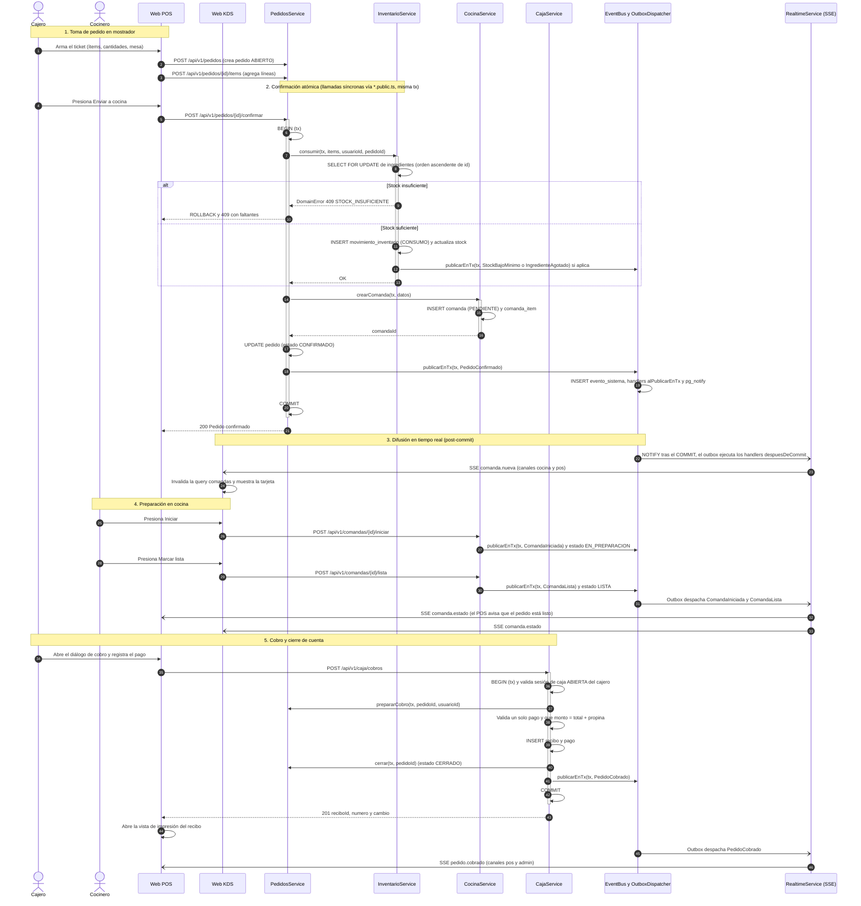

# Arquitectura del Sistema — MonsterBurguer POS

> **Documento vivo de arquitectura de software.**  
> Basado en principios de arquitectura de software, el Enfoque de Sistemas del documento académico original (*Etapa 1 — Definición del Sistema*) y reflejo fidedigno del código fuente implementado en el repositorio.

---

## 1. Visión General y Estilo Arquitectónico

MonsterBurguer POS es un **Monolito Modular Full-Stack en TypeScript**:
- Un único servicio backend desplegable construido con **NestJS 12**, dividido en módulos independientes con fronteras estrictas.
- Una interfaz web de usuario SPA construida con **React 19**, **Vite 8** y **Tailwind CSS v4**.
- Un único motor de base de datos relacional **PostgreSQL 17** (desarrollo local) / compatible **PG 18** (producción en Docker).
- Módulos organizados 1:1 con los subsistemas definidos en el Enfoque de Sistemas: cada subsistema es un módulo de código y cada interacción entre ellos es un evento de dominio transaccional o una invocación explícita mediante una fachada pública (`*.public.ts`).

---

## 2. Modelo C4

### 2.1. Nivel 1: Diagrama de Contexto (C4-Context)
Describe cómo el sistema interactúa con los distintos actores del restaurante y el entorno operativo en la red local.



---

### 2.2. Nivel 2: Diagrama de Contenedores (C4-Container)
Ilustra los contenedores ejecutables, tecnologías y protocolos de comunicación en la LAN del restaurante.



---

### 2.3. Nivel 3: Diagrama de Componentes de la API (C4-Component)
Muestra la organización modular interna de `apps/api/src` y el flujo de comunicación.



---

## 3. Módulos y Responsabilidades

| Subsistema | Módulo | Responsabilidad Principal en el MVP | Fachada Pública (`*.public.ts`) |
|---|---|---|---|
| **Empleados** | `identidad` | Login con throttling, revocación de sesiones opacas en base de datos, decoradores de autenticación y guards RBAC. | `IdentidadPublic`, `Roles`, `Publico`, `UsuarioActual` |
| **Productos** | `catalogo` | Menú para POS, categorías, productos, recetas de ingredientes, override de disponibilidad (agotado). | `CatalogoPublicService` |
| **Clientes** | `clientes` | Búsqueda y registro opcional de clientes asociados al pedido. | `ClientesPublicService` |
| **Pedidos** | `pedidos` | Creación de tickets para mesa o llevar, control de mesas ocupadas, adición/edición de ítems y confirmación atómica. | `PedidosPublicService` |
| **Cocina** | `cocina` | Generación de comandas, avance de estados de preparación en KDS y cálculo de tiempos. | `CocinaPublicService` |
| **Inventario** | `inventario` | Control de stock por unidad base, consumo por recetas con `FOR UPDATE`, entradas, ajustes, mermas y kardex. | `InventarioPublicService` |
| **Facturación** | `caja` | Apertura/cierre de turnos de caja, cobro atómico, emisión de recibos y registro de pagos. | `CajaPublicService` |
| **Administración**| `administracion` | Agregación de KPIs para el Dashboard mediante vistas SQL, métricas de ventas y bitácora de auditoría. | `AdministracionPublicService` |
| **Tiempo Real** | `realtime` | Hub SSE (`/api/v1/stream`), distribución de eventos por canales según rol, gestión de reconexión y replay. | `RealtimeModule`, `RealtimeService` |

### Reglas de Dependencia y Fronteras
1. **Importación exclusiva de `*.public.ts`:** Ningún módulo puede importar controladores, servicios internos, esquemas o repositorios de otro módulo. La herramienta `dependency-cruiser` verifica esta regla en cada corrida de CI.
2. **Propiedad estricta de tablas:** Un módulo solo lee y escribe en sus propias tablas relacionales.
3. **Comunicación síncrona transaccional:** Cuando una operación requiere atomicidad entre módulos (ej. confirmar pedido y descontar inventario), el servicio emisor invoca al servicio público del otro módulo **pasando la instancia de transacción `tx` activa**.
4. **Desacoplamiento asíncrono:** Notificaciones, reactividad visual y recálculos secundarios se propagan exclusivamente mediante eventos de dominio procesados por el outbox.

---

## 4. Bus de Eventos y Patrón Outbox (`evento_sistema`)

Para garantizar consistencia y evitar el problema de la doble escritura (*dual write*), el sistema utiliza el patrón **Transactional Outbox**:

```
Transacción de Negocio (BEGIN)
  ├── 1. Mutaciones en tablas del módulo (pedido, pedido_item, etc.)
  ├── 2. Invocaciones a servicios públicos con tx (consumo inventario, comanda)
  ├── 3. EventBus.publicarEnTx(tx, evento)
  │      ├── INSERT INTO evento_sistema (tipo, modulo, payload, ...)
  │      ├── Ejecutar handlers transaccionales (alPublicarEnTx) con tx
  │      └── SELECT pg_notify('evento_sistema', id)
  └── COMMIT
       │
       ▼ (Postgres despacha NOTIFY al confirmar el COMMIT)
  OutboxDispatcher (LISTEN evento_sistema)
  ├── Despierta instantáneamente (o por sondeo cada 5 s de respaldo)
  ├── SELECT ... FROM evento_sistema WHERE procesado_at IS NULL FOR UPDATE SKIP LOCKED
  ├── Ejecuta handlers post-commit (despuesDeCommit) -> RealtimeService (SSE)
  └── UPDATE evento_sistema SET procesado_at = now()
```

### Catálogo de Eventos del Dominio

| Evento | Módulo Emisor | Tipo de Reacción | Destinatario Principal |
|---|---|:---:|---|
| `PedidoConfirmado` | `pedidos` | Post-commit | `realtime` → emite `comanda.nueva` a canales `cocina` y `pos`. |
| `ComandaIniciada` | `cocina` | Post-commit | `realtime` → emite `comanda.estado` a `cocina` y `pos`. |
| `ComandaLista` | `cocina` | Post-commit | `realtime` → emite `comanda.estado` a `cocina` y `pos` (notifica pedido listo). |
| `ComandaEntregada` | `cocina` | Post-commit | `realtime` → emite `comanda.estado` a `cocina` y `pos`. |
| `PedidoCobrado` | `caja` | Post-commit | `realtime` → emite `pedido.cobrado` a `pos` y `admin` (refresca KPIs y mesas). |
| `SesionCajaCerrada`| `caja` | Post-commit | Auditoría interna en `evento_sistema`. |
| `StockBajoMinimo` | `inventario` | Post-commit | `realtime` → emite `inventario.alerta` a canal `admin`. |
| `IngredienteAgotado`| `inventario` | Post-commit | `catalogo` (marca `agotado = true`) y `realtime` (emite alerta a admin). |
| `IngredienteRepuesto`| `inventario`| Post-commit | `catalogo` (re-evalúa disponibilidad) y `realtime` (`catalogo.disponibilidad`). |

---

## 5. Diagrama de Secuencia: Flujo de una Venta Completa

Representación exacta de las transacciones, validaciones y eventos durante una venta en el restaurante:



---

## 6. Seguridad y Protección de la Información

1. **Sesiones Opacas y Cookies Seguras:**
   - La autenticación no expone tokens en el cliente ni utiliza JWTs susceptibles de robo por XSS.
   - Generación de tokens aleatorios de 256 bits (`crypto.randomBytes(32)`).
   - En la base de datos (`sesion_usuario`) únicamente se almacena el hash SHA-256 en hexadecimal del token.
   - La cookie de sesión `mb_session` se envía con atributos `HttpOnly`, `SameSite=Strict`, `Path=/`, y `Secure` según `COOKIE_SECURE`.
   - Expiración deslizante: si transcurren más de 5 minutos de actividad, el backend actualiza la expiración en la base de datos y reemite la cookie.
2. **Hasheo de Contraseñas:**
   - Algoritmo **argon2id** con parámetros recomendados de memoria y tiempo (`$argon2id$v=19$m=65536,p=4,t=3$`).
   - Mitigación de *timing attacks*: en intentos de login con usuarios inexistentes, se ejecuta una verificación con un hash ficticio precalculado para igualar el tiempo de cómputo.
3. **Protección contra CSRF (Cross-Site Request Forgery):**
   - Combinación de `SameSite=Strict` en la cookie y validación obligatoria de la cabecera `Origin` en `OrigenGuard` para todos los métodos mutantes (`POST`, `PATCH`, `PUT`, `DELETE`).
4. **Protección contra Fuerza Bruta (Throttling):**
   - `@nestjs/throttler` configurado globalmente (600 peticiones/minuto) y con límite estricto de **5 peticiones por minuto por IP** en `POST /api/v1/auth/login`.
5. **Cabeceras HTTP de Seguridad:**
   - Integración de **Helmet** en `app.factory.ts` para deshabilitar sniffing MIME, XSS auditor legado y ocultar la firma del framework (`X-Powered-By`).

---

## 7. Atributos de Calidad (ISO 25010)

- **Consistencia y Fiabilidad (AC-1):** Cero transacciones parciales. Descuento de inventario y confirmación de pedidos ocurren bajo la misma transacción ACID de PostgreSQL con bloqueos pesimistas ordenados (`SELECT ... FOR UPDATE`), previniendo condiciones de carrera ante múltiples terminales concurrentes.
- **Rendimiento y Latencia (AC-2):** El flujo de eventos mediante `LISTEN/NOTIFY` entrega notificaciones a las pantallas KDS en ≤ 2 segundos.
- **Mantenibilidad (AC-3):** Verificación automatizada de fronteras de módulos mediante `dependency-cruiser`. Cero código muerto, contratos tipados compartidos y reglas de negocio documentadas con código trazable (`RN-xx`).
- **Seguridad Operativa (AC-4):** Bitácora inmutable de auditoría en `evento_sistema` que registra el usuario responsable, timestamp UTC y payload de toda acción sensible (anulaciones, ajustes de inventario, cierres de caja).

---

## 8. Registro de Decisiones de Arquitectura (ADR)

Las decisiones estructurales tomadas en el proyecto se encuentran formalizadas de forma independiente en la carpeta [`docs/adr/`](./docs/adr/):

- [**ADR-001:** TypeScript Full-Stack (NestJS + React)](./docs/adr/0001-typescript-fullstack.md)
- [**ADR-002:** PostgreSQL 17 (Dev Local) / Compatible PG 18 como Base de Datos](./docs/adr/0002-postgresql-como-base-de-datos.md)
- [**ADR-003:** Drizzle ORM como Capa de Acceso a Datos](./docs/adr/0003-drizzle-orm.md)
- [**ADR-004:** Arquitectura de Monolito Modular](./docs/adr/0004-monolito-modular.md)
- [**ADR-005:** Eventos de Dominio con Patrón Outbox en PostgreSQL (`evento_sistema`)](./docs/adr/0005-eventos-de-dominio-con-outbox-en-postgresql.md)
- [**ADR-006:** Server-Sent Events (SSE) para Tiempo Real](./docs/adr/0006-server-sent-events-sse.md)
- [**ADR-007:** Sesiones Opacas en Base de Datos con Cookies HttpOnly y Hashes Argon2id](./docs/adr/0007-sesiones-opacas-en-base-de-datos-con-cookies-httponly.md)
- [**ADR-008:** Manejo de Dinero en Enteros (Pesos Colombianos - COP)](./docs/adr/0008-dinero-en-enteros-pesos-cop.md)
- [**ADR-009:** Cantidades de Inventario en Enteros de Unidad Base (`G`, `ML`, `UND`)](./docs/adr/0009-cantidades-de-inventario-en-enteros-de-unidad-base.md)
- [**ADR-010:** Frontend SPA con React 19, Vite 8 y React Router](./docs/adr/0010-spa-con-react-19-y-vite-8.md)
- [**ADR-011:** Régimen NO_RESPONSABLE Parametrizable y Recibo Interno No Fiscal](./docs/adr/0011-regimen-no-responsable-y-recibo-no-fiscal.md)
