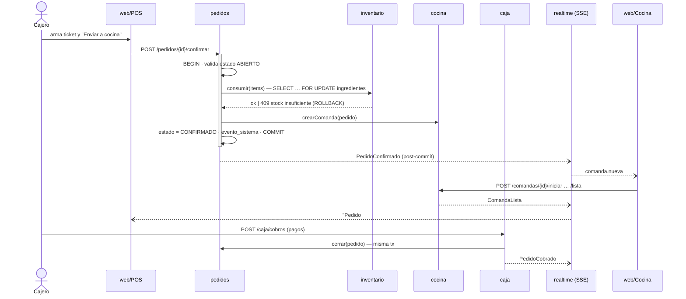

# Arquitectura — MonsterBurguer POS

> Documento vivo. Toda decisión que cambie lo aquí descrito se registra en la sección [Decisiones](#11-decisiones-adr).

## 1. Visión general

**Monolito modular en TypeScript**: un solo backend desplegable (NestJS) dividido en módulos con fronteras estrictas, una SPA (React) y PostgreSQL. Los módulos corresponden 1:1 a los subsistemas definidos en el documento de Enfoque de Sistemas, y las interacciones entre ellos ocurren por **servicios públicos** y **eventos de dominio**, nunca accediendo a tablas ajenas.

```
            ┌──────────────────────── Navegadores (LAN del restaurante) ─────────────────────────┐
            │  Tablet/PC caja (POS)      Pantalla cocina (KDS)       PC admin (Dashboard)        │
            └──────────────┬──────────────────────┬─────────────────────────┬───────────────────┘
                           │ HTTPS (REST + SSE, cookie de sesión)            │
                    ┌──────▼─────────────────────────────────────────────────▼──────┐
                    │  nginx  — sirve apps/web (estático) y proxy /api → api        │
                    └──────────────────────────────┬────────────────────────────────┘
                    ┌──────────────────────────────▼────────────────────────────────┐
                    │  apps/api (NestJS)                                            │
                    │  ┌──────────┐ ┌─────────┐ ┌────────┐ ┌──────────┐ ┌────────┐  │
                    │  │ catalogo │ │ pedidos │ │ cocina │ │inventario│ │  caja  │  │
                    │  └──────────┘ └─────────┘ └────────┘ └──────────┘ └────────┘  │
                    │  ┌──────────┐ ┌──────────────┐ ┌──────────┐ ┌──────────────┐  │
                    │  │ clientes │ │administracion│ │ identidad│ │  realtime    │  │
                    │  └──────────┘ └──────────────┘ └──────────┘ └──────────────┘  │
                    │  shared-kernel: db, eventos, dinero, errores, reloj            │
                    └──────────────────────────────┬────────────────────────────────┘
                                          ┌────────▼────────┐
                                          │ PostgreSQL 18   │
                                          └─────────────────┘
```

## 2. Stack

| Capa | Tecnología | Motivo |
|---|---|---|
| Lenguaje | **TypeScript 6.0** (strict) en todo el repo | Un solo lenguaje; tipos compartidos front/back |
| Runtime | **Node.js 24 LTS** | LTS vigente |
| Backend | **NestJS 12** | Módulos, DI y guards encajan con un monolito modular; muy documentado |
| ORM / SQL | **Drizzle ORM** + `drizzle-kit` (migraciones SQL versionadas) | SQL-first, tipado, soporta `SELECT … FOR UPDATE` y transacciones explícitas (crítico para stock y dinero) |
| Validación | **Zod 4** (esquemas en `@mb/shared`) | Mismo esquema valida en el formulario y en la API |
| Base de datos | **PostgreSQL 17 (dev) / compatible 18** | Ver [ADR-002](#11-decisiones-adr) |
| Auth | Sesiones opacas en Postgres + cookie `HttpOnly`, hash **argon2id** | Revocación inmediata, funciona con SSE, sin complejidad JWT |
| Tiempo real | **SSE** (`@Sse()` de NestJS) | KDS y caja solo necesitan recibir; acciones van por REST |
| Logs | **pino** (`nestjs-pino`) | JSON estructurado, rápido |
| Frontend | **React 19 + Vite 8 + React Router 8** | SPA rápida; el POS no necesita SSR/SEO |
| Datos servidor (front) | **TanStack Query** | Caché, reintentos, invalidación por eventos SSE |
| Estado local (front) | **Zustand** | Ticket en curso del POS |
| UI | **Tailwind CSS v4 + shadcn/ui + lucide-react** | Componentes accesibles (Radix) y propios |
| Formularios | **react-hook-form + zod** | Validación compartida |
| Gráficos | **Recharts** | Dashboard |
| Tests | **Vitest 5**, **PostgreSQL dedicado (`DATABASE_URL_TEST`)**, **Playwright** (E2E) | |
| Monorepo | **pnpm workspaces** | Sin herramientas extra |
| Calidad | ESLint + Prettier, `tsc --noEmit`, Husky + lint-staged | |
| Infra | Docker Compose, GitHub Actions | |

## 3. Estructura del monorepo

```
apps/
  api/
    src/
      main.ts
      app.module.ts
      shared-kernel/          # db (drizzle client, tx), eventos, dinero, errores, reloj
      modules/
        identidad/            # usuarios, login, sesiones, roles
        catalogo/             # categorías, productos, recetas, disponibilidad
        clientes/
        pedidos/              # pedidos, items, mesas
        cocina/               # comandas, estados de preparación
        inventario/           # ingredientes, movimientos, alertas
        caja/                 # sesiones de caja, cobros, recibos, pagos
        administracion/       # dashboard, reportes, reglas de retroalimentación
        realtime/             # hub SSE
    drizzle/                  # migraciones SQL generadas
    test/                     # integración (Testcontainers)
  web/
    src/
      app/                    # router, providers, layout por rol
      features/               # pos/, cocina/, inventario/, caja/, admin/, auth/
      components/ui/          # shadcn/ui
      lib/                    # api client, sse, formato de moneda
packages/
  shared/
    src/
      schemas/                # zod: pedido, producto, pago, …
      money.ts                # cálculo de impuestos y totales (puro, testeado)
      enums.ts                # estados, roles, métodos de pago
```

### Estructura interna de un módulo (backend)

```
modules/pedidos/
  pedidos.module.ts
  pedidos.controller.ts        # HTTP: valida con zod, delega al servicio
  pedidos.service.ts           # casos de uso (transacciones)
  pedidos.repository.ts        # queries Drizzle — solo tablas de este módulo
  pedidos.schema.ts            # tablas Drizzle de este módulo
  pedidos.events.ts            # eventos que publica
  pedidos.public.ts            # API pública para otros módulos (único import permitido)
  pedidos.service.spec.ts
```

**Reglas de frontera** (verificadas con `dependency-cruiser` en CI):
- Un módulo solo importa de otro módulo su `*.public.ts`.
- Un módulo solo consulta sus propias tablas. Las FK entre módulos existen en la BD (integridad), pero las lecturas cruzadas pasan por la API pública.
- `shared-kernel` no importa de ningún módulo.

## 4. Mapa de subsistemas → módulos

| Subsistema (documento) | Módulo | Responsabilidad en MVP |
|---|---|---|
| Clientes | `clientes` | Registro opcional del cliente en el pedido |
| Productos | `catalogo` | Menú, precios, recetas, disponibilidad (agotado) |
| Pedidos | `pedidos` | Crear, editar, confirmar, anular pedidos; mesas |
| Cocina | `cocina` | Comandas y su ciclo de preparación (KDS) |
| Inventario | `inventario` | Stock por ingrediente, consumo por receta, entradas, ajustes, alertas |
| Facturación | `caja` | Sesión de caja, cobro, pagos, recibo POS |
| Administración | `administracion` | Dashboard, reportes, reglas de retroalimentación |
| Empleados | `identidad` | Usuarios, roles, autenticación |
| — (transversal) | `realtime` | Difusión SSE de eventos a pantallas |

## 5. Interacción entre módulos: eventos de dominio

Dos tipos de reacción a un evento, según si debe ser **atómica** con la operación que lo produce:

1. **Handlers transaccionales (síncronos, misma transacción).** Si fallan, se revierte todo. Se usan cuando el negocio no tolera un estado intermedio (p. ej. un pedido confirmado sin comanda o sin descuento de stock).
2. **Handlers post-commit (asíncronos).** Se ejecutan después del `COMMIT`. Se usan para notificaciones, SSE, estadísticas y reglas de retroalimentación. Si fallan se reintentan desde la tabla `evento_sistema` (outbox).

Todo evento se persiste en `evento_sistema` **dentro de la misma transacción** (outbox + bitácora de interacciones). Esa tabla es la que Administración usa para mostrar "cómo interactúan los subsistemas".

### Implementación

```ts
// shared-kernel/events
export interface EventoDominio<T = unknown> {
  tipo: string;
  modulo: string;
  agregadoId?: string | null;
  usuarioId?: string | null;
  payload: T;
}

export interface EventoPublicado<T = unknown> extends EventoDominio<T> {
  id: number;
  createdAt: Date;
}

export class EventBus {
  // Los módulos registran handlers explícitamente (ej. en onModuleInit)
  alPublicarEnTx(tipo: string, handler: (tx: Tx, evento: EventoPublicado) => Promise<void>): void;
  despuesDeCommit(tipo: string, handler: (evento: EventoPublicado) => Promise<void>): void;

  // Dentro de la transacción: persiste en evento_sistema y ejecuta handlers transaccionales
  publicarEnTx<T>(tx: Tx, evento: EventoDominio<T>): Promise<EventoPublicado<T>>;
}
```

El dispatcher post-commit corre en el mismo proceso: `LISTEN/NOTIFY` (canal `evento_sistema`) para despertar al instante + sondeo de respaldo cada 5 s sobre `evento_sistema WHERE procesado_at IS NULL … FOR UPDATE SKIP LOCKED`.

### Catálogo de eventos (MVP)

| Evento | Publica | Handlers en transacción | Handlers post-commit |
|---|---|---|---|
| `PedidoConfirmado` | pedidos | inventario: consumir según receta · cocina: crear comanda | realtime: notificar KDS · administracion: métricas |
| `PedidoAnulado` | pedidos | inventario: revertir consumo (si comanda PENDIENTE) o registrar merma · cocina: anular comanda | realtime |
| `ComandaIniciada` / `ComandaLista` / `ComandaEntregada` | cocina | — | realtime: notificar POS · administracion: tiempos de preparación |
| `PedidoCobrado` | caja | pedidos: cerrar pedido (y confirmar si estaba ABIERTO) | realtime · administracion: ventas |
| `StockBajoMinimo` | inventario | — | administracion: alerta · realtime |
| `IngredienteAgotado` | inventario | — | catalogo: marcar productos agotados (retroalimentación) · realtime |
| `IngredienteRepuesto` | inventario | — | catalogo: re-evaluar disponibilidad · realtime |
| `SesionCajaCerrada` | caja | — | administracion: reporte de cierre |

## 6. Recorrido del pedido (flujo principal)



> En hamburguesería de mostrador el cobro puede ocurrir **antes** de que cocina termine (pago anticipado). El estado de cocina (comanda) y el de pago (pedido) son independientes; ver [BUSINESS_RULES.md](./docs/BUSINESS_RULES.md).

## 7. Máquinas de estado

**Pedido** (módulo `pedidos`)

```
ABIERTO ──confirmar──► CONFIRMADO ──cobrar──► CERRADO
   │  └─────────── cobrar (pago anticipado: confirma + cierra) ───────►┘
   └──anular──► ANULADO ◄──anular── CONFIRMADO   (solo ADMIN, con motivo; nunca desde CERRADO en MVP)
```
- En `ABIERTO` se pueden agregar/quitar/editar ítems. En `CONFIRMADO` no (MVP).

**Comanda** (módulo `cocina`)

```
PENDIENTE ──iniciar──► EN_PREPARACION ──marcarLista──► LISTA ──entregar──► ENTREGADA
     └────────────── anular (por PedidoAnulado) ──────────────► ANULADA
```

**Sesión de caja** (módulo `caja`): `ABIERTA ──cerrar──► CERRADA`.

Las transiciones se validan en el servicio; la columna `version` (bloqueo optimista) evita que dos terminales cambien el mismo pedido a la vez.

## 8. Tiempo real (SSE)

- Endpoint único `GET /api/stream?canales=cocina,pos,admin` (requiere sesión).
- El hub `realtime` suscribe handlers post-commit y emite mensajes `{ tipo, id, datos, ts }`.
- El front usa `EventSource` y, al recibir un mensaje, **invalida la query** de TanStack correspondiente (no aplica parches manuales al estado): simple y consistente.
- Reconexión automática del navegador + `Last-Event-ID` → el servidor reenvía desde `evento_sistema`.
- Heartbeat cada 25 s para que proxies no cierren la conexión.

## 9. Seguridad

- **Autenticación:** usuario + contraseña → sesión opaca (token aleatorio de 256 bits; en BD solo su hash SHA-256) en cookie `HttpOnly; Secure; SameSite=Strict`. Expiración deslizante 12 h. Logout invalida en BD.
- **Contraseñas:** argon2id.
- **Autorización:** guard por rol (`@Roles('ADMIN')`) + reglas en servicio (p. ej. anular requiere ADMIN).
- **CSRF:** `SameSite=Strict` + verificación de cabecera `Origin` en métodos mutantes.
- **Rate limit** en `/auth/login` (`@nestjs/throttler`).
- **Validación** de toda entrada con Zod; respuestas de error con formato único (`{ codigo, mensaje, detalles? }`).
- **Auditoría:** toda acción sensible (anulación, ajuste de inventario, cierre de caja) queda en `evento_sistema` con `usuario_id`.
- **Secretos** solo por variables de entorno (`.env` fuera de git; `.env.example` versionado).

Roles del MVP: `ADMIN`, `CAJERO`, `COCINA`. (`MESERO` llega en v1.1 con la vista móvil.)

## 10. Calidad, pruebas y despliegue

| Nivel | Herramienta | Qué cubre |
|---|---|---|
| Unitario | Vitest | `@mb/shared/money`, máquinas de estado, reglas de servicio |
| Integración | Vitest + PostgreSQL dedicado (`DATABASE_URL_TEST`) | Casos de uso con BD real: login/sesiones, confirmar pedido descuenta stock, concurrencia de stock, cierre de caja |
| Fronteras | dependency-cruiser | Ningún módulo importa internos de otro |
| E2E | Playwright | "Venta completa": login → ticket → cocina → cobro → recibo |

- **CI (GitHub Actions):** `pnpm install --frozen-lockfile` → lint → typecheck → test → build.
- **Despliegue MVP:** un PC/mini-servidor en la LAN del restaurante con `docker compose up -d` (postgres + api + nginx/web). HTTPS con Caddy y certificado local.
- **Respaldo:** `pg_dump` diario por cron a disco externo/nube (script en `ops/backup.sh`).
- **Entornos:** `development` (local), `production` (restaurante). Variables: `DATABASE_URL`, `SESSION_SECRET`, `TZ=America/Bogota`, `APP_ORIGIN`.

## 11. Decisiones (ADR)

| # | Decisión | Alternativas | Motivo |
|---|---|---|---|
| 001 | TypeScript full-stack (NestJS + React) | Java/Spring, Python/FastAPI | Un lenguaje, tipos y esquemas compartidos, un solo toolchain |
| 002 | PostgreSQL 17 (dev local) / compatible 18 | MySQL, SQLite | Transacciones y bloqueo de filas robustos, `CHECK`/índices parciales para invariantes de negocio, JSONB para eventos, `LISTEN/NOTIFY`, funciones de ventana para reportes. Dev usa PG 17 local con base de test dedicada (`DATABASE_URL_TEST`); producción/CI usan contenedor PostgreSQL. |
| 003 | Drizzle ORM | Prisma, TypeORM | SQL explícito, `FOR UPDATE`, transacciones interactivas, migraciones SQL legibles |
| 004 | Monolito modular | Microservicios | Un restaurante, un servidor; fronteras claras sin coste operativo |
| 005 | Eventos con outbox en Postgres | Redis/RabbitMQ | Cero infraestructura extra; atomicidad con la transacción de negocio |
| 006 | SSE | WebSocket/Socket.IO | Flujo unidireccional; funciona con cookie; reconexión nativa |
| 007 | Sesiones en BD | JWT | Revocación inmediata (empleado despedido); sin refresh tokens |
| 008 | Dinero en enteros (pesos COP) | `numeric` + decimales | COP no usa centavos; aritmética exacta en JS sin librerías |
| 009 | Cantidades de inventario en enteros de unidad base (g, ml, und) | `numeric(12,3)` | Exactitud sin decimales en JS |
| 010 | SPA (Vite) | Next.js | Sin SEO/SSR; despliegue estático simple en LAN |
| 011 | Régimen `NO_RESPONSABLE` (impuesto 0) parametrizable; recibo interno no fiscal; DEE POS DIAN diferido a v2 | Integrar proveedor tecnológico desde el MVP | El MVP es para llevar las cuentas del negocio; `regimen_tributario` permite pasar a INC 8 % / IVA 19 % sin cambiar código; la emisión electrónica se integra antes de operar formalmente |
