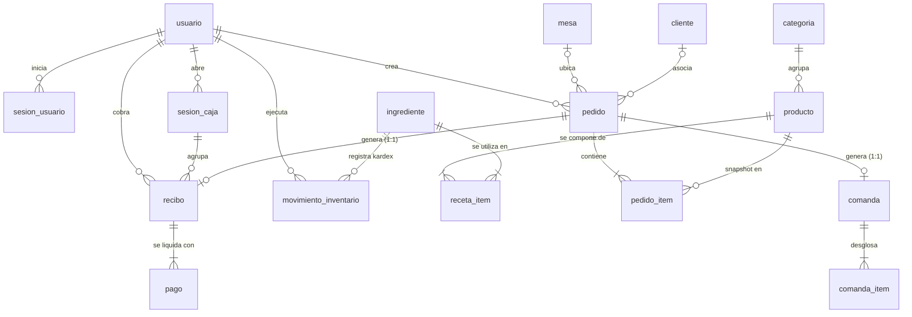

# Modelo de Datos — MonsterBurguer POS (PostgreSQL 17 / Compatible PG 18)

> **Especificación relacional oficial alineada 1:1 con los esquemas de Drizzle ORM (`apps/api/src/**/*.schema.ts`) y las migraciones SQL (`apps/api/drizzle/*.sql`).**

---

## 1. Convenciones de Diseño Relacional

- **Nomenclatura:** Tablas y columnas en `snake_case`, en idioma español y en singular (`pedido`, `pedido_item`, `recibo`).
- **Claves Primarias (PK):** Columna `id uuid` generada en la aplicación como **UUID v7** (tiempo-ordenable, compatible de forma nativa con PostgreSQL 17 y 18 sin extensiones adicionales). Excepciones: `configuracion` (PK `clave text`), `contador_dia` (PK `fecha_operativa date`), `evento_sistema` (PK `id bigint IDENTITY`), y tablas intermedias compuestas (`receta_item`).
- **Marcas de Tiempo:** Columnas de fecha y hora en `timestamp with time zone` (`timestamptz`), siempre almacenadas en UTC.
- **Dinero:** Columnas de tipo `bigint` que representan valores monetarios como **enteros en pesos colombianos (COP)** sin decimales (RN-01).
- **Inventario:** Cantidades de stock y recetas en `bigint` o `integer` en la unidad base (`G`, `ML`, `UND`) (RN-30). Costos unitarios en milésimas de peso COP (COP × 1.000).
- **Estados y Enums:** Columnas de texto `text` con restricciones `CHECK (columna IN (...))` sincronizadas con `@mb/shared/enums.ts`.
- **Bloqueo Optimista:** Columna `version integer NOT NULL DEFAULT 0` en entidades sujetas a concurrencia de múltiples terminales (`pedido`, `comanda`, `sesion_caja`).
- **Fronteras Modulares:** Cada tabla pertenece exclusivamente a un módulo del monolito. Las claves foráneas cruzadas existen en la base de datos para preservar la integridad referencial relacional, pero las consultas en código respetan las fachadas públicas (`*.public.ts`).

---

## 2. Diagrama Entidad-Relación (ERD)

*Nota sobre el alcance del MVP:* La tabla de movimientos manuales de caja (`movimiento_caja`) no está creada en las migraciones de base de datos del MVP; los balances de caja actuales computan `montoApertura + ventasEfectivo` (ver ADR-011 y ROADMAP).

---

## 3. Diccionario de Datos por Módulo

### 3.1. Módulo `identidad`

#### Tabla `usuario`
Almacena las cuentas del personal del restaurante.

| Columna | Tipo PostgreSQL | Restricciones | Descripción |
|---|---|---|---|
| `id` | `uuid` | `PRIMARY KEY` | Identificador único (UUID v7). |
| `nombre` | `text` | `NOT NULL` | Nombre completo del empleado. |
| `username` | `text` | `NOT NULL, UNIQUE` | Nombre de usuario en minúsculas (`CHECK username = lower(username)`). |
| `password_hash` | `text` | `NOT NULL` | Hash argon2id (`$argon2id$v=19$...`). |
| `rol` | `text` | `NOT NULL` | `CHECK (rol IN ('ADMIN', 'CAJERO', 'COCINA'))`. |
| `activo` | `boolean` | `NOT NULL DEFAULT true` | Estado de activación del usuario. |
| `created_at` | `timestamptz` | `NOT NULL DEFAULT now()` | Fecha y hora de creación. |
| `updated_at` | `timestamptz` | `NOT NULL DEFAULT now()` | Fecha y hora de última modificación. |

#### Tabla `sesion_usuario`
Sesiones activas opacas con revocación inmediata.

| Columna | Tipo PostgreSQL | Restricciones | Descripción |
|---|---|---|---|
| `id` | `uuid` | `PRIMARY KEY` | Identificador único de sesión. |
| `usuario_id` | `uuid` | `NOT NULL, FK -> usuario(id) ON DELETE CASCADE` | Usuario autenticado. |
| `token_hash` | `text` | `NOT NULL, UNIQUE` | Hash SHA-256 en hexadecimal del token de la cookie `mb_session`. |
| `expira_at` | `timestamptz` | `NOT NULL` | Momento de vencimiento de la sesión. |
| `ultimo_uso_at`| `timestamptz` | `NOT NULL DEFAULT now()` | Última interacción (para expiración deslizante). |
| `user_agent` | `text` | `NULL` | Cabecera User-Agent del navegador. |
| `ip` | `text` | `NULL` | Dirección IP remota del cliente. |
| `created_at` | `timestamptz` | `NOT NULL DEFAULT now()` | Momento de inicio de sesión. |

*Índices:* `sesion_usuario_usuario_idx` en `usuario_id`, `sesion_usuario_expira_idx` en `expira_at`.

---

### 3.2. Módulo `catalogo`

#### Tabla `categoria`
Clasificación de productos exhibidos en el POS.

| Columna | Tipo PostgreSQL | Restricciones | Descripción |
|---|---|---|---|
| `id` | `uuid` | `PRIMARY KEY` | Identificador de categoría. |
| `nombre` | `text` | `NOT NULL, UNIQUE` | Nombre de la categoría (ej. "Hamburguesas", "Bebidas"). |
| `orden` | `integer` | `NOT NULL DEFAULT 0` | Posición en el rail de navegación del POS. |
| `activa` | `boolean` | `NOT NULL DEFAULT true` | Visibilidad en el menú. |
| `created_at` | `timestamptz` | `NOT NULL DEFAULT now()` | Fecha de creación. |
| `updated_at` | `timestamptz` | `NOT NULL DEFAULT now()` | Fecha de actualización. |

#### Tabla `producto`
Artículos del menú disponibles para venta.

| Columna | Tipo PostgreSQL | Restricciones | Descripción |
|---|---|---|---|
| `id` | `uuid` | `PRIMARY KEY` | Identificador del producto. |
| `categoria_id` | `uuid` | `NOT NULL, FK -> categoria(id) ON DELETE RESTRICT` | Categoría a la que pertenece. |
| `nombre` | `text` | `NOT NULL` | Nombre del producto. Índice único case-insensitive. |
| `descripcion` | `text` | `NULL` | Descripción o ingredientes destacados. |
| `precio` | `bigint` | `NOT NULL, CHECK (precio > 0)` | Precio final al consumidor en pesos COP (RN-02). |
| `imagen_url` | `text` | `NULL` | Ruta de la imagen del producto. |
| `activo` | `boolean` | `NOT NULL DEFAULT true` | Si el producto está habilitado para el negocio. |
| `agotado` | `boolean` | `NOT NULL DEFAULT false` | Calculado automáticamente según stock de ingredientes (RN-36). |
| `agotado_manual`| `boolean` | `NULL` | Override manual del administrador (`true`/`false`/`null`). |
| `orden` | `integer` | `NOT NULL DEFAULT 0` | Orden de despliegue en la grilla del POS. |
| `created_at` | `timestamptz` | `NOT NULL DEFAULT now()` | Fecha de registro. |
| `updated_at` | `timestamptz` | `NOT NULL DEFAULT now()` | Fecha de modificación. |

*Índices:* `producto_nombre_lower_idx UNIQUE` sobre `lower(nombre)`.

#### Tabla `receta_item`
Composición de ingredientes requeridos para elaborar una unidad de un producto.

| Columna | Tipo PostgreSQL | Restricciones | Descripción |
|---|---|---|---|
| `producto_id` | `uuid` | `NOT NULL, FK -> producto(id) ON DELETE CASCADE` | Producto elaborado. |
| `ingrediente_id`| `uuid` | `NOT NULL, FK -> ingrediente(id) ON DELETE CASCADE`| Ingrediente consumido. |
| `cantidad` | `integer` | `NOT NULL, CHECK (cantidad > 0)` | Cantidad requerida en la unidad base del ingrediente (RN-31). |

*Clave primaria compuesta:* `PRIMARY KEY (producto_id, ingrediente_id)`.

---

### 3.3. Módulo `inventario`

#### Tabla `ingrediente`
Materias primas controladas por stock.

| Columna | Tipo PostgreSQL | Restricciones | Descripción |
|---|---|---|---|
| `id` | `uuid` | `PRIMARY KEY` | Identificador del ingrediente. |
| `nombre` | `text` | `NOT NULL, UNIQUE` | Nombre de la materia prima (ej. "Pan Brioche", "Carne 150g"). |
| `unidad` | `text` | `NOT NULL` | `CHECK (unidad IN ('G', 'ML', 'UND'))` (RN-30). |
| `stock_actual` | `bigint` | `NOT NULL DEFAULT 0` | Stock físico actual en unidad base. |
| `stock_minimo` | `bigint` | `NOT NULL DEFAULT 0, CHECK (stock_minimo >= 0)` | Umbral mínimo para alertas de reposición (RN-36). |
| `costo_unitario`| `bigint` | `NOT NULL DEFAULT 0, CHECK (costo_unitario >= 0)` | Costo por unidad base expresado en milésimas de peso COP (COP × 1.000). |
| `activo` | `boolean` | `NOT NULL DEFAULT true` | Si el ingrediente se encuentra en uso activo. |
| `created_at` | `timestamptz` | `NOT NULL DEFAULT now()` | Fecha de creación. |
| `updated_at` | `timestamptz` | `NOT NULL DEFAULT now()` | Fecha de modificación. |

#### Tabla `movimiento_inventario`
Kardex inmutable de auditoría de inventario (RN-34).

| Columna | Tipo PostgreSQL | Restricciones | Descripción |
|---|---|---|---|
| `id` | `uuid` | `PRIMARY KEY` | Identificador del movimiento. |
| `ingrediente_id`| `uuid` | `NOT NULL, FK -> ingrediente(id) ON DELETE RESTRICT` | Ingrediente afectado. |
| `tipo` | `text` | `NOT NULL` | `CHECK (tipo IN ('CONSUMO', 'ENTRADA', 'AJUSTE', 'MERMA', 'REVERSION'))`. |
| `cantidad` | `bigint` | `NOT NULL, CHECK (cantidad != 0)` | Cantidad con signo (+ entradas, - consumos/mermas). |
| `stock_resultante`| `bigint` | `NOT NULL` | Saldo final del ingrediente inmediatamente después del movimiento. |
| `referencia_tipo`| `text` | `NULL` | Tipo de entidad causante (`PEDIDO`, `MANUAL`, `CONTEO`). |
| `referencia_id` | `uuid` | `NULL` | ID del pedido o registro causante. |
| `usuario_id` | `uuid` | `NOT NULL, FK -> usuario(id) ON DELETE RESTRICT` | Empleado responsable del movimiento. |
| `motivo` | `text` | `NULL` | Justificación obligatoria en mermas y ajustes físicos. |
| `created_at` | `timestamptz` | `NOT NULL DEFAULT now()` | Momento exacto del movimiento. |

*Índices:* `movimiento_inventario_ingrediente_created_idx` sobre `(ingrediente_id, created_at)`.

---

### 3.4. Módulo `clientes`

#### Tabla `cliente`
Datos opcionales de fidelización y contacto del comensal.

| Columna | Tipo PostgreSQL | Restricciones | Descripción |
|---|---|---|---|
| `id` | `uuid` | `PRIMARY KEY` | Identificador del cliente. |
| `nombre` | `text` | `NOT NULL` | Nombre o razón social. |
| `telefono` | `text` | `NULL` | Teléfono de contacto. |
| `documento` | `text` | `NULL` | Cédula o NIT para identificación. |
| `email` | `text` | `NULL` | Correo electrónico. |
| `created_at` | `timestamptz` | `NOT NULL DEFAULT now()` | Fecha de registro. |
| `updated_at` | `timestamptz` | `NOT NULL DEFAULT now()` | Fecha de modificación. |

*Índices:* `cliente_telefono_unique` índice parcial único sobre `telefono WHERE telefono IS NOT NULL`.

---

### 3.5. Módulo `pedidos`

#### Tabla `mesa`
Distribución física de salones y comedores del restaurante.

| Columna | Tipo PostgreSQL | Restricciones | Descripción |
|---|---|---|---|
| `id` | `uuid` | `PRIMARY KEY` | Identificador de la mesa. |
| `nombre` | `text` | `NOT NULL, UNIQUE` | Nombre visual ("Mesa 1", "Barra 2"). |
| `capacidad` | `integer` | `NOT NULL DEFAULT 4` | Puestos disponibles. |
| `activa` | `boolean` | `NOT NULL DEFAULT true` | Si está disponible para asignación. |
| `orden` | `integer` | `NOT NULL DEFAULT 0` | Secuencia visual en el plano de mesas. |
| `created_at` | `timestamptz` | `NOT NULL DEFAULT now()` | Fecha de creación. |
| `updated_at` | `timestamptz` | `NOT NULL DEFAULT now()` | Fecha de actualización. |

#### Tabla `contador_dia`
Generador transaccional de numeración consecutiva diaria.

| Columna | Tipo PostgreSQL | Restricciones | Descripción |
|---|---|---|---|
| `fecha_operativa`| `date` | `PRIMARY KEY` | Fecha operativa de negocio (`YYYY-MM-DD`, RN-16). |
| `ultimo_numero` | `integer` | `NOT NULL DEFAULT 0` | Último consecutivo emitido en ese día (para gritar en cocina: "#014"). |

#### Tabla `pedido`
Cabecera del ticket de compra.

| Columna | Tipo PostgreSQL | Restricciones | Descripción |
|---|---|---|---|
| `id` | `uuid` | `PRIMARY KEY` | Identificador global del pedido. |
| `fecha_operativa`| `date` | `NOT NULL` | Fecha operativa del turno (RN-16). |
| `numero_dia` | `integer` | `NOT NULL` | Número secuencial del día (1..N). |
| `tipo` | `text` | `NOT NULL` | `CHECK (tipo IN ('MESA', 'LLEVAR'))` (RN-10). |
| `mesa_id` | `uuid` | `NULL, FK -> mesa(id)` | Mesa asignada. `CHECK ((tipo = 'MESA') = (mesa_id IS NOT NULL))` (RN-11). |
| `cliente_id` | `uuid` | `NULL, FK -> cliente(id) ON DELETE SET NULL` | Cliente comensal opcional. |
| `usuario_id` | `uuid` | `NOT NULL, FK -> usuario(id)` | Cajero que inició el pedido. |
| `estado` | `text` | `NOT NULL DEFAULT 'ABIERTO'` | `CHECK (estado IN ('ABIERTO', 'CONFIRMADO', 'CERRADO', 'ANULADO'))`. |
| `total` | `bigint` | `NOT NULL DEFAULT 0, CHECK (total >= 0)` | Monto total acumulado en pesos COP (RN-04). |
| `base` | `bigint` | `NOT NULL DEFAULT 0` | Base gravable calculada antes de impuestos (RN-04). |
| `impuesto` | `bigint` | `NOT NULL DEFAULT 0` | Impuesto calculado (0 con régimen NO_RESPONSABLE). |
| `nota` | `text` | `NULL` | Observación general del pedido. |
| `confirmado_at` | `timestamptz` | `NULL` | Momento de envío a cocina. |
| `cerrado_at` | `timestamptz` | `NULL` | Momento de cobro en caja. |
| `anulado_at` | `timestamptz` | `NULL` | Momento de anulación. |
| `anulado_por` | `uuid` | `NULL, FK -> usuario(id)` | Administrador que autorizó la anulación. |
| `motivo_anulacion`| `text` | `NULL` | Causa de la anulación (mínimo 5 caracteres, RN-50). |
| `version` | `integer` | `NOT NULL DEFAULT 0` | Versión para control de concurrencia optimista. |
| `created_at` | `timestamptz` | `NOT NULL DEFAULT now()` | Fecha de apertura. |
| `updated_at` | `timestamptz` | `NOT NULL DEFAULT now()` | Fecha de modificación. |

*Restricciones e Índices Clave:*
- `pedido_fecha_numero_uq UNIQUE (fecha_operativa, numero_dia)`: Garantiza que no se repitan números de comanda en un mismo día operativo.
- `pedido_mesa_activa_uq UNIQUE (mesa_id) WHERE estado IN ('ABIERTO', 'CONFIRMADO')`: Invariante de negocio que impide asignar más de un pedido no cerrado a una misma mesa (RN-11).
- `pedido_estado_fecha_idx` sobre `(estado, fecha_operativa)`: Optimización para filtros del POS y Dashboard.

#### Tabla `pedido_item`
Líneas de detalle de un pedido.

| Columna | Tipo PostgreSQL | Restricciones | Descripción |
|---|---|---|---|
| `id` | `uuid` | `PRIMARY KEY` | Identificador de línea. |
| `pedido_id` | `uuid` | `NOT NULL, FK -> pedido(id) ON DELETE CASCADE` | Pedido contenedor. |
| `producto_id` | `uuid` | `NOT NULL, FK -> producto(id) ON DELETE RESTRICT`| Producto ordenado. |
| `nombre_producto`| `text` | `NOT NULL` | Snapshot inmutable del nombre al momento de agregar (RN-05). |
| `precio_unitario`| `bigint` | `NOT NULL` | Snapshot inmutable del precio unitario en COP (RN-05). |
| `cantidad` | `integer` | `NOT NULL, CHECK (cantidad BETWEEN 1 AND 99)` | Unidades ordenadas (RN-12). |
| `nota` | `text` | `NULL, CHECK (nota IS NULL OR length(nota) <= 140)` | Instrucciones culinarias de la línea (RN-12). |
| `total_linea` | `bigint` | `NOT NULL` | = `precio_unitario * cantidad` (COP). |
| `orden` | `integer` | `NOT NULL DEFAULT 0` | Secuencia de inserción en el ticket. |

*Índices:* `pedido_item_pedido_idx` en `pedido_id`.

---

### 3.6. Módulo `cocina`

#### Tabla `comanda`
Cabecera de la orden en la pantalla de cocina (KDS).

| Columna | Tipo PostgreSQL | Restricciones | Descripción |
|---|---|---|---|
| `id` | `uuid` | `PRIMARY KEY` | Identificador de la comanda. |
| `pedido_id` | `uuid` | `NOT NULL, UNIQUE, FK -> pedido(id) ON DELETE RESTRICT`| Pedido asociado (relación 1:1, RN-20). |
| `numero_dia` | `integer` | `NOT NULL` | Número consecutivo del día para visualización grande. |
| `tipo_pedido` | `text` | `NOT NULL` | `CHECK (tipo_pedido IN ('MESA', 'LLEVAR'))`. |
| `mesa_nombre` | `text` | `NULL` | Copia desnormalizada del nombre de mesa. |
| `estado` | `text` | `NOT NULL DEFAULT 'PENDIENTE'` | `CHECK (estado IN ('PENDIENTE', 'EN_PREPARACION', 'LISTA', 'ENTREGADA', 'ANULADA'))` (RN-21). |
| `iniciada_at` | `timestamptz` | `NULL` | Momento en que cocina presiona "Iniciar". |
| `lista_at` | `timestamptz` | `NULL` | Momento en que cocina presiona "Marcar Lista". |
| `entregada_at` | `timestamptz` | `NULL` | Momento en que se entrega al mesero o mostrador. |
| `anulada_at` | `timestamptz` | `NULL` | Momento de anulación por cancelación de pedido. |
| `version` | `integer` | `NOT NULL DEFAULT 0` | Control de concurrencia optimista en KDS. |
| `created_at` | `timestamptz` | `NOT NULL DEFAULT now()` | Momento de llegada a cocina (confirmación del pedido). |

*Índices:* `comanda_activas_idx` índice parcial sobre `(estado, created_at) WHERE estado IN ('PENDIENTE', 'EN_PREPARACION', 'LISTA')` para rendimiento óptimo del KDS.

#### Tabla `comanda_item`
Líneas de producción de la comanda (cocina opera sin leer `pedido_item`).

| Columna | Tipo PostgreSQL | Restricciones | Descripción |
|---|---|---|---|
| `id` | `uuid` | `PRIMARY KEY` | Identificador del ítem de comanda. |
| `comanda_id` | `uuid` | `NOT NULL, FK -> comanda(id) ON DELETE CASCADE`| Comanda contenedora. |
| `nombre` | `text` | `NOT NULL` | Nombre descriptivo del producto a elaborar. |
| `cantidad` | `integer` | `NOT NULL` | Cantidad a cocinar. |
| `nota` | `text` | `NULL` | Modificaciones solicitadas (ej. "Sin cebolla"). |
| `orden` | `integer` | `NOT NULL DEFAULT 0` | Orden de despliegue. |

*Índices:* `comanda_item_comanda_idx` en `comanda_id`.

---

### 3.7. Módulo `caja`

#### Secuencia `recibo_numero_seq`
Secuencia PostgreSQL de 64 bits utilizada para emitir consecutivos numéricos correlativos globales de recibos (`R-000001`, `R-000002`).

#### Tabla `sesion_caja`
Apertura, balance y arqueo de caja por cajero (RN-40, RN-47).

| Columna | Tipo PostgreSQL | Restricciones | Descripción |
|---|---|---|---|
| `id` | `uuid` | `PRIMARY KEY` | Identificador de la sesión de caja. |
| `usuario_id` | `uuid` | `NOT NULL, FK -> usuario(id)` | Cajero responsable del turno. |
| `estado` | `text` | `NOT NULL DEFAULT 'ABIERTA'` | `CHECK (estado IN ('ABIERTA', 'CERRADA'))`. |
| `monto_apertura`| `bigint` | `NOT NULL, CHECK (monto_apertura >= 0)` | Base inicial en efectivo al abrir turno (RN-41). |
| `efectivo_esperado`| `bigint` | `NULL` | Calculado al cierre: `montoApertura + ventasEfectivo` (RN-47). |
| `efectivo_contado`| `bigint` | `NULL` | Dinero físico contado por el cajero al cerrar. |
| `diferencia` | `bigint` | `NULL` | `efectivoContado - efectivoEsperado` (sobrante + / faltante -). |
| `abierta_at` | `timestamptz` | `NOT NULL DEFAULT now()` | Momento de apertura. |
| `cerrada_at` | `timestamptz` | `NULL` | Momento de cierre definitivo e irreversible. |
| `version` | `integer` | `NOT NULL DEFAULT 0` | Control de concurrencia optimista. |

*Índice clave:* `sesion_caja_abierta_usuario_uq UNIQUE (usuario_id) WHERE estado = 'ABIERTA'` (garantiza máximo una sesión abierta simultánea por cajero, RN-40).

#### Tabla `recibo`
Comprobante interno de cobro POS (RN-45).

| Columna | Tipo PostgreSQL | Restricciones | Descripción |
|---|---|---|---|
| `id` | `uuid` | `PRIMARY KEY` | Identificador único del recibo. |
| `numero` | `bigint` | `NOT NULL, UNIQUE, DEFAULT nextval('recibo_numero_seq')` | Consecutivo global ascendente. |
| `pedido_id` | `uuid` | `NOT NULL, UNIQUE, FK -> pedido(id)` | Pedido cobrado (un recibo por pedido, RN-44). |
| `sesion_caja_id`| `uuid` | `NOT NULL, FK -> sesion_caja(id)` | Sesión de caja en la que se recaudó el dinero. |
| `usuario_id` | `uuid` | `NOT NULL, FK -> usuario(id)` | Cajero que procesó el cobro. |
| `total` | `bigint` | `NOT NULL` | Total de los productos vendidos en COP (RN-04). |
| `base` | `bigint` | `NOT NULL` | Base gravable (RN-04). |
| `impuesto` | `bigint` | `NOT NULL` | Impuesto recaudado (0 bajo NO_RESPONSABLE). |
| `impuesto_tasa_bp`| `integer` | `NOT NULL DEFAULT 0` | Snapshot de la tasa tributaria en puntos básicos (0 / 800 / 1900). |
| `regimen_tributario`| `text` | `NOT NULL` | Snapshot del régimen vigente (`NO_RESPONSABLE`, `INC_8`, `IVA_19`). |
| `propina` | `bigint` | `NOT NULL DEFAULT 0` | Propina voluntaria aceptada por el cliente en COP (RN-06). |
| `created_at` | `timestamptz` | `NOT NULL DEFAULT now()` | Fecha y hora de emisión del recibo. |

*Índices:* `recibo_sesion_idx` en `sesion_caja_id`.

#### Tabla `pago`
Métodos y montos de liquidación del recibo.

| Columna | Tipo PostgreSQL | Restricciones | Descripción |
|---|---|---|---|
| `id` | `uuid` | `PRIMARY KEY` | Identificador del registro de pago. |
| `recibo_id` | `uuid` | `NOT NULL, FK -> recibo(id) ON DELETE CASCADE`| Recibo correspondiente. |
| `metodo` | `text` | `NOT NULL` | `CHECK (metodo IN ('EFECTIVO', 'TARJETA', 'TRANSFERENCIA'))` (RN-42). |
| `monto` | `bigint` | `NOT NULL, CHECK (monto > 0)` | Monto imputado a la cuenta en COP. |
| `recibido` | `bigint` | `NULL` | Efectivo entregado por el cliente (`CHECK recibido IS NULL OR recibido >= monto`). |
| `cambio` | `bigint` | `NULL` | Vueltas entregadas al cliente (`recibido - monto`). |
| `referencia` | `text` | `NULL` | Voucher de datáfono o ID de transferencia Nequi/Daviplata. |

*Índice clave:* `pago_efectivo_por_recibo_uq UNIQUE (recibo_id) WHERE metodo = 'EFECTIVO'` (máximo un pago en efectivo por recibo, RN-43).

---

### 3.8. Núcleo Compartido (`shared-kernel`)

#### Tabla `evento_sistema`
Outbox transaccional y bitácora inmutable de eventos de dominio (ADR-005, RN-60).

| Columna | Tipo PostgreSQL | Restricciones | Descripción |
|---|---|---|---|
| `id` | `bigint` | `PRIMARY KEY GENERATED ALWAYS AS IDENTITY` | Secuencia incremental estricta; sirve de `Last-Event-ID` en SSE. |
| `tipo` | `text` | `NOT NULL` | Tipo de evento (`PedidoConfirmado`, `ComandaLista`, etc.). |
| `modulo` | `text` | `NOT NULL` | Módulo emisor (`pedidos`, `cocina`, `caja`, `inventario`). |
| `agregado_id` | `uuid` | `NULL` | ID de la entidad principal afectada. |
| `usuario_id` | `uuid` | `NULL` | Usuario que ejecutó la acción (para auditoría). |
| `payload` | `jsonb` | `NOT NULL` | Datos estructurados del evento. |
| `created_at` | `timestamptz` | `NOT NULL DEFAULT now()` | Momento de publicación dentro de la transacción. |
| `procesado_at`| `timestamptz` | `NULL` | Momento en que el OutboxDispatcher ejecutó los handlers post-commit. |
| `intentos` | `integer` | `NOT NULL DEFAULT 0` | Número de reintentos ejecutados. |
| `ultimo_error`| `text` | `NULL` | Mensaje de error si algún handler post-commit falló. |

*Índices:*
- `evento_sistema_pendiente_idx` índice parcial sobre `id WHERE procesado_at IS NULL` para escaneo ultra-rápido del OutboxDispatcher.
- `evento_sistema_created_at_idx` en `created_at`.
- `evento_sistema_tipo_idx` en `(tipo, created_at)`.

#### Tabla `configuracion`
Parámetros del negocio editables en caliente.

| Columna | Tipo PostgreSQL | Restricciones | Descripción |
|---|---|---|---|
| `clave` | `text` | `PRIMARY KEY` | Nombre del parámetro (`regimen_tributario`, `negocio`, etc.). |
| `valor` | `jsonb` | `NOT NULL` | Contenido JSON del valor configurado. |
| `updated_at` | `timestamptz` | `NOT NULL DEFAULT now()` | Fecha de última actualización. |
| `updated_by` | `uuid` | `NULL` | Usuario administrador que realizó el cambio. |

---

## 4. Vistas SQL para Reportes (`administracion`)

Creadas por la migración `0003_hito2_4_pedidos_cocina_caja.sql`. El módulo `administracion` consulta estas vistas agregadas en modo solo lectura:

1. **`v_ventas_dia`:**
   - Agrupa por `p.fecha_operativa`.
   - Campos: `fecha_operativa`, `total`, `base`, `impuesto`, `propinas`, `pedidos` (cantidad), `ticket_promedio`.
   - Fuente: `pedido p JOIN recibo r ON r.pedido_id = p.id WHERE p.estado = 'CERRADO'`.
2. **`v_ventas_producto`:**
   - Agrupa por `fecha_operativa`, `producto_id`, `nombre_producto`.
   - Campos: `fecha_operativa`, `producto_id`, `nombre`, `unidades` (suma de cantidades), `monto` (suma de total_linea).
   - Fuente: `pedido_item i JOIN pedido p ON p.id = i.pedido_id WHERE p.estado = 'CERRADO'`.
3. **`v_ventas_hora`:**
   - Agrupa por `fecha_operativa` y hora local (`extract(hour FROM r.created_at AT TIME ZONE 'America/Bogota')`).
   - Campos: `fecha_operativa`, `hora`, `total`, `pedidos`.
4. **`v_tiempos_cocina`:**
   - Métricas de desempeño de comandas cerradas: `promedio_seg` y `p90_seg` (percentil 90) de tiempo de preparación (`lista_at - created_at`), y conteo de `comandas`.
5. **`v_stock_alertas`:**
   - Ingredientes activos cuyo `stock_actual <= stock_minimo`.
   - Campos: `ingrediente_id`, `nombre`, `unidad`, `stock_actual`, `stock_minimo`, `agotado: boolean`.
6. **`v_productos_agotados`:**
   - Productos activos marcados como agotados (`agotado = true`).
   - Campos: `producto_id`, `nombre`, `agotado_manual`.
