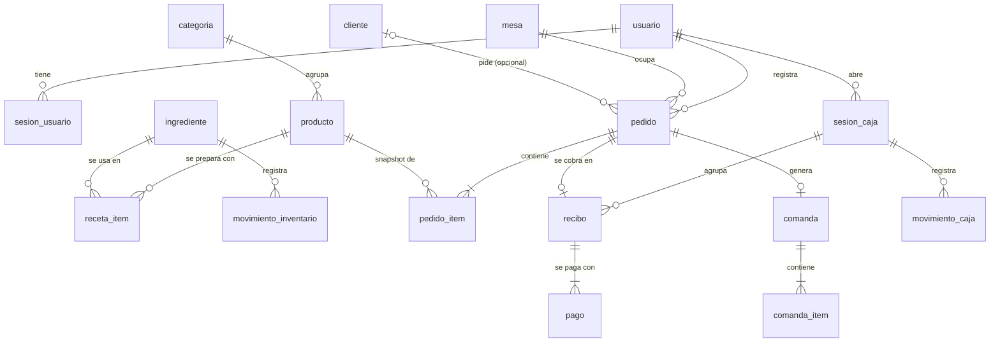

# Modelo de datos — MonsterBurguer POS (PostgreSQL 17 / compatible PG 18)

## Convenciones

- Tablas y columnas en `snake_case`, en español y en singular (`pedido`, `pedido_item`).
- PK `id uuid` generado en la aplicación como **UUID v7** (ordenable por tiempo, compatible con PG 17 y PG 18 sin requerir extensión o función nativa de BD).
- Fechas `timestamptz` (UTC). Columnas `created_at` / `updated_at` en todas las tablas mutables.
- Dinero: `bigint` en **pesos COP** (RN-01). Cantidades de inventario: `integer`/`bigint` en unidad base (RN-30).
- Estados como `text` + `CHECK (estado IN (...))` (más fácil de migrar que `ENUM`); los valores viven en `@mb/shared/enums.ts`.
- Bloqueo optimista: `version integer NOT NULL DEFAULT 0` en `pedido`, `comanda`, `sesion_caja`.
- Cada tabla pertenece a **un módulo** (columna "Módulo"). Solo ese módulo la escribe o la consulta.

## ERD

## Tablas

### Módulo `identidad`

**usuario**

| Columna | Tipo | Restricciones |
|---|---|---|
| id | uuid | PK (generado en app con UUID v7) |
| nombre | text | NOT NULL |
| username | text | UNIQUE NOT NULL, CHECK (`username = lower(username)`) |
| password_hash | text | NOT NULL (argon2id) |
| rol | text | CHECK IN (`ADMIN`,`CAJERO`,`COCINA`) |
| activo | boolean | DEFAULT true |
| created_at, updated_at | timestamptz | |

**sesion_usuario**

| Columna | Tipo | Restricciones |
|---|---|---|
| id | uuid | PK (generado en app con UUID v7) |
| usuario_id | uuid | FK → usuario |
| token_hash | text | UNIQUE NOT NULL (SHA-256 en formato hex del token de la cookie) |
| expira_at | timestamptz | NOT NULL, índice |
| ultimo_uso_at | timestamptz | |
| user_agent, ip | text | |
| created_at | timestamptz | |

### Módulo `catalogo`

**categoria**: `id`, `nombre text UNIQUE`, `orden int`, `activa boolean`, timestamps.

**producto**

| Columna | Tipo | Restricciones |
|---|---|---|
| id | uuid | PK |
| categoria_id | uuid | FK → categoria |
| nombre | text | NOT NULL, UNIQUE (case-insensitive) |
| descripcion | text | |
| precio | bigint | CHECK > 0 (COP, precio final al público, RN-02) |
| imagen_url | text | nullable |
| activo | boolean | DEFAULT true |
| agotado | boolean | DEFAULT false (automático, RN-36) |
| agotado_manual | boolean | nullable (override del admin: true/false/null = automático) |
| orden | int | |
| created_at, updated_at | timestamptz | |

**receta_item**: PK (`producto_id`, `ingrediente_id`), `cantidad integer CHECK > 0`.
> `receta_item.ingrediente_id` es FK a una tabla de `inventario`: integridad en BD, pero `catalogo` obtiene datos de ingredientes vía `inventario.public.ts`.

### Módulo `inventario`

**ingrediente**

| Columna | Tipo | Restricciones |
|---|---|---|
| id | uuid | PK |
| nombre | text | UNIQUE NOT NULL |
| unidad | text | CHECK IN (`G`,`ML`,`UND`) |
| stock_actual | bigint | NOT NULL DEFAULT 0 (CHECK ≥ 0 salvo `permitir_stock_negativo`) |
| stock_minimo | bigint | NOT NULL DEFAULT 0 |
| costo_unitario | bigint | COP por unidad base × 1000 (milésimas de peso, para costos por gramo) |
| activo | boolean | |
| created_at, updated_at | timestamptz | |

**movimiento_inventario** (solo inserción)

| Columna | Tipo | Restricciones |
|---|---|---|
| id | uuid | PK |
| ingrediente_id | uuid | FK, índice (`ingrediente_id`, `created_at`) |
| tipo | text | CHECK IN (`CONSUMO`,`ENTRADA`,`AJUSTE`,`MERMA`,`REVERSION`) |
| cantidad | bigint | con signo, ≠ 0 |
| stock_resultante | bigint | stock tras el movimiento (kardex) |
| referencia_tipo | text | `PEDIDO`, `ENTRADA`, `CONTEO`… |
| referencia_id | uuid | nullable |
| usuario_id | uuid | FK → usuario |
| motivo | text | obligatorio en `AJUSTE`/`MERMA` |
| created_at | timestamptz | |

### Módulo `clientes`

**cliente**: `id`, `nombre`, `telefono` (UNIQUE parcial si no nulo), `documento`, `email`, timestamps.

### Módulo `pedidos`

**mesa**: `id`, `nombre text UNIQUE` ("Mesa 4"), `capacidad int`, `activa boolean`, `orden int`.

**pedido**

| Columna | Tipo | Restricciones |
|---|---|---|
| id | uuid | PK |
| fecha_operativa | date | NOT NULL (RN-16) |
| numero_dia | int | NOT NULL; UNIQUE (`fecha_operativa`, `numero_dia`) |
| tipo | text | CHECK IN (`MESA`,`LLEVAR`) |
| mesa_id | uuid | FK nullable; CHECK (`tipo`='MESA') = (`mesa_id` IS NOT NULL) |
| cliente_id | uuid | FK nullable |
| usuario_id | uuid | FK → usuario (quien lo creó) |
| estado | text | CHECK IN (`ABIERTO`,`CONFIRMADO`,`CERRADO`,`ANULADO`) |
| total | bigint | CHECK ≥ 0 (denormalizado = Σ items) |
| base | bigint | |
| impuesto | bigint | |
| nota | text | |
| confirmado_at, cerrado_at, anulado_at | timestamptz | |
| anulado_por | uuid | FK → usuario |
| motivo_anulacion | text | |
| version | int | bloqueo optimista |
| created_at, updated_at | timestamptz | |

Índices clave:
- `UNIQUE (mesa_id) WHERE estado IN ('ABIERTO','CONFIRMADO')` → una mesa, un pedido activo (RN-11).
- `(estado, fecha_operativa)` para listas del POS y dashboard.

**pedido_item**

| Columna | Tipo | Restricciones |
|---|---|---|
| id | uuid | PK |
| pedido_id | uuid | FK ON DELETE CASCADE |
| producto_id | uuid | FK |
| nombre_producto | text | snapshot (RN-05) |
| precio_unitario | bigint | snapshot |
| cantidad | int | CHECK 1..99 |
| nota | text | CHECK length ≤ 140 |
| total_linea | bigint | = precio_unitario × cantidad |
| orden | int | |

**contador_dia**: (`fecha_operativa` PK, `ultimo_numero int`) — se incrementa con `UPDATE … RETURNING` dentro de la transacción para obtener `numero_dia`.

### Módulo `cocina`

**comanda**

| Columna | Tipo | Restricciones |
|---|---|---|
| id | uuid | PK |
| pedido_id | uuid | FK UNIQUE (una comanda por pedido, RN-20) |
| numero_dia | int | copia para mostrar |
| tipo_pedido | text | copia (`MESA`/`LLEVAR`) |
| mesa_nombre | text | copia |
| estado | text | CHECK IN (`PENDIENTE`,`EN_PREPARACION`,`LISTA`,`ENTREGADA`,`ANULADA`) |
| iniciada_at, lista_at, entregada_at, anulada_at | timestamptz | |
| version | int | |
| created_at | timestamptz | |

Índice: `(estado, created_at) WHERE estado IN ('PENDIENTE','EN_PREPARACION','LISTA')` para el KDS.

**comanda_item**: `id`, `comanda_id` FK, `nombre text`, `cantidad int`, `nota text`, `orden int` (copia de los ítems; cocina no consulta `pedido_item`).

### Módulo `caja`

**sesion_caja**

| Columna | Tipo | Restricciones |
|---|---|---|
| id | uuid | PK |
| usuario_id | uuid | FK; `UNIQUE (usuario_id) WHERE estado='ABIERTA'` (RN-40) |
| estado | text | CHECK IN (`ABIERTA`,`CERRADA`) |
| monto_apertura | bigint | CHECK ≥ 0 |
| efectivo_esperado | bigint | al cerrar |
| efectivo_contado | bigint | al cerrar |
| diferencia | bigint | al cerrar |
| abierta_at, cerrada_at | timestamptz | |
| version | int | |

**movimiento_caja**: `id`, `sesion_caja_id` FK, `tipo` CHECK IN (`INGRESO`,`RETIRO`), `monto bigint CHECK > 0`, `motivo text NOT NULL`, `usuario_id`, `created_at`.

**recibo**

| Columna | Tipo | Restricciones |
|---|---|---|
| id | uuid | PK |
| numero | bigint | UNIQUE, de `SEQUENCE recibo_numero_seq` (se muestra `R-000001`) |
| pedido_id | uuid | FK UNIQUE (RN-44) |
| sesion_caja_id | uuid | FK |
| usuario_id | uuid | FK (cajero) |
| total | bigint | |
| base | bigint | |
| impuesto | bigint | |
| impuesto_tasa_bp | int | tasa vigente al cobrar (snapshot; 0 con régimen `NO_RESPONSABLE`) |
| regimen_tributario | text | snapshot del régimen al cobrar |
| propina | bigint | DEFAULT 0 |
| created_at | timestamptz | |

**pago**

| Columna | Tipo | Restricciones |
|---|---|---|
| id | uuid | PK |
| recibo_id | uuid | FK |
| metodo | text | CHECK IN (`EFECTIVO`,`TARJETA`,`TRANSFERENCIA`) |
| monto | bigint | CHECK > 0 (aplicado a la cuenta) |
| recibido | bigint | solo EFECTIVO; CHECK ≥ monto |
| cambio | bigint | solo EFECTIVO |
| referencia | text | voucher / id transferencia |

Índice parcial: `UNIQUE (recibo_id) WHERE metodo='EFECTIVO'` (un solo pago en efectivo por cobro, RN-43).

### Transversal (`shared-kernel`)

**evento_sistema** (outbox + bitácora, RN-60)

| Columna | Tipo | Restricciones |
|---|---|---|
| id | bigint | GENERATED ALWAYS AS IDENTITY (orden estricto, sirve de `Last-Event-ID` para SSE) |
| tipo | text | `PedidoConfirmado`, … |
| modulo | text | módulo emisor |
| agregado_id | uuid | |
| usuario_id | uuid | nullable |
| payload | jsonb | |
| created_at | timestamptz | índice |
| procesado_at | timestamptz | null = pendiente para handlers post-commit; índice parcial `WHERE procesado_at IS NULL` |
| intentos | int | DEFAULT 0 |
| ultimo_error | text | |

**configuracion**: `clave text PK`, `valor jsonb`, `updated_at`, `updated_by`. Claves iniciales: `regimen_tributario` (`NO_RESPONSABLE` por defecto; determina `impuesto_nombre` e `impuesto_tasa_bp`, RN-03), `propina_sugerida_bp`, `hora_corte_dia`, `permitir_stock_negativo`, `kds_umbral_warning_min`, `kds_umbral_grave_min`, `negocio` (razón social, NIT, dirección, teléfono para el recibo).

## Vistas para reportes (módulo `administracion`)

Solo lectura, creadas por migración:

- `v_ventas_dia` — por `fecha_operativa`: total, base, impuesto, propinas, nº pedidos, ticket promedio.
- `v_ventas_producto` — por fecha y producto: unidades y monto (desde `pedido_item` de pedidos `CERRADO`).
- `v_ventas_hora` — por fecha y hora local.
- `v_tiempos_cocina` — por fecha: promedio y p90 de `lista_at − created_at`.
- `v_stock_alertas` — ingredientes con `stock_actual ≤ stock_minimo`.

> `administracion` es el único módulo que lee transversalmente, y solo a través de estas vistas, nunca de las tablas directamente. Si el volumen crece, `v_ventas_*` pasan a vistas materializadas refrescadas al cerrar caja.
