# Manual del Sistema para Proyecto de Software — MonsterBurguer POS

**Universidad de Cartagena**  
**Facultad de Ingeniería**  
**Programa de Ingeniería de Sistemas**  
**Asignatura:** Ingeniería de Software  
**Docente:** Ing. Martín Monroy Ríos, MSc, PhD  
**Estudiante:** [COMPLETAR: nombre completo del estudiante] [COMPLETAR: Integrantes adicionales del grupo si aplica]  
**Fecha:** Octubre de 2026  

---

## Introducción

Este documento sirve como el **Manual del Sistema** para el proyecto de software **MonsterBurguer POS**. Su propósito es detallar formalmente el modelo de negocio, la especificación de requisitos, el modelo de diseño estructurado mediante las Vistas 4+1 de Kruchten y el modelo de implementación física de la solución, proporcionando una referencia técnica completa y exhaustiva para desarrolladores, arquitectos de software, administradores de sistemas y partes interesadas.

Este manual fue preparado por el equipo de desarrollo de ingeniería de software a partir del análisis del documento académico de base *Etapa 1 — Definición del Sistema Restaurante* y de la base de código real implementada en el repositorio. La versión actual del documento se encuentra versionada y almacenada en el repositorio del proyecto.

---

## 1. Modelo de Negocio

Esta sección describe el contexto organizacional y operativo del restaurante, detallando las técnicas de recolección de información empleadas, los procesos de negocio generales y específicos modelados mediante diagramas de actividades UML, los casos de uso del mundo real, el modelo conceptual de dominio y el glosario de términos del negocio.

La recolección de información se llevó a cabo utilizando las siguientes técnicas:

| Técnica | Descripción | Resultados Obtenidos |
|---|---|---|
| **Análisis Documental y Conceptual del Sistema** | Revisión profunda del documento académico *Etapa 1 — Definición del Sistema Restaurante*, estableciendo la delimitación entre el sistema y su entorno, sus siete subsistemas principales y las relaciones de retroalimentación. | Delimitación formal de fronteras del sistema, definición de los siete subsistemas funcionales y comprensión del ciclo de vida del pedido. Documento base: `Etapa1_Definicion_del_Sistema_Restaurante.docx`. |
| **Ingeniería de Requisitos Ágiles (PRD)** | Descomposición de la operación en 7 épicas y 22 historias de usuario estructuradas bajo el formato estándar de la industria, definiendo criterios de aceptación verificables y metas de desempeño operacionales. | Formalización del alcance del MVP y backlog de versiones futuras (v1.1, v1.2 y v2). Documento base: `docs/PRD.md`. |
| **Levantamiento y Verificación de Reglas de Negocio** | Catalogación sistemática de 32 reglas operativas (RN-01 a RN-61) agrupadas en 7 dimensiones (Dinero, Pedidos, Cocina, Inventario, Caja, Permisos y Auditoría). | Matriz unívoca de reglas de negocio enlazadas al código fuente de backend y frontend que las ejecuta. Documento base: `docs/BUSINESS_RULES.md`. |
| **Observación Operativa de Punto de Venta** | Estudio de campo sobre el flujo de atención en mostrador y cocina en restaurantes de comidas rápidas [COMPLETAR: Establecimiento observado y fecha de visita]. | Especificación de los requisitos de usabilidad táctil, umbrales de alerta de cocina (8 y 12 minutos) y necesidad de recibos POS no fiscales de 80 mm. |

---

### 1.1 Procesos de Negocio

El proceso de negocio general que el sistema automatiza y articula es la **Gestión Integral de Venta y Servicio Gastronómico en MonsterBurguer**.

#### Proceso de Negocio General
El proceso general comprende desde el arribo del cliente al salón o mostrador, la toma de su orden en la terminal de punto de venta, la verificación atómica y descuento de existencias en inventario, la transmisión en tiempo real de la orden a la pantalla KDS de cocina, la preparación y control de tiempos por parte de los cocineros, la recepción del pago en caja con liquidación de cambio y propina, la emisión del comprobante impreso, hasta la consolidación de estadísticas en el panel gerencial.

El proceso general se representa a continuación:

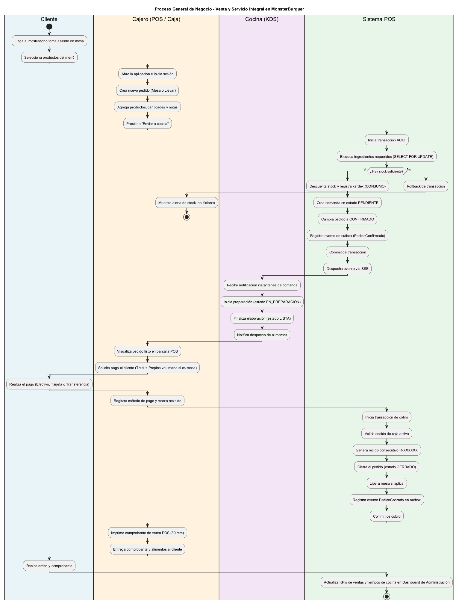  
*Figura 1. Diagrama de actividades del proceso de negocio general: ciclo de venta y servicio en MonsterBurguer.*

Los procesos específicos que componen la esencia del problema y que son abordados directamente por la solución de software incluyen:

#### Proceso Específico 1: Toma y Confirmación de Pedido (POS)
Este proceso describe cómo el cajero atiende al cliente, discrimina el tipo de orden (para salón o para llevar), asigna la mesa validando su disponibilidad, compone el ticket seleccionando productos, cantidades y notas culinarias especiales, y confirma la orden disparando la reserva atómica de inventario.

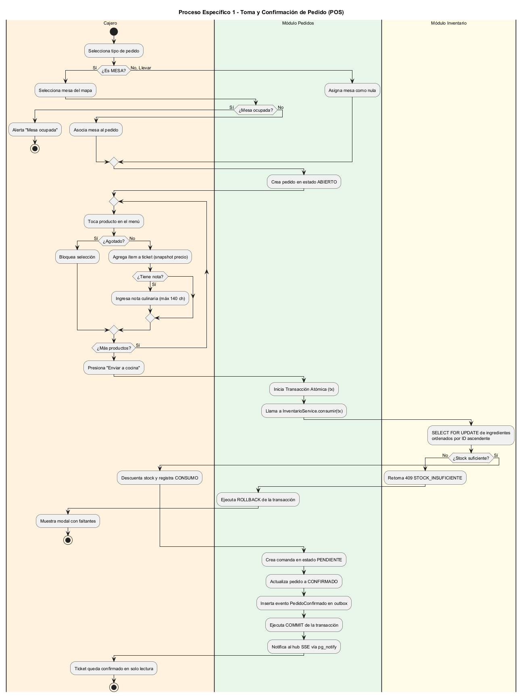  
*Figura 2. Diagrama de actividades: toma y confirmación de pedidos en el mostrador.*

#### Proceso Específico 2: Preparación y Despacho en Cocina (KDS)
Este proceso describe cómo el equipo de cocina recibe de manera asíncrona y en tiempo real las comandas confirmadas a través del protocolo Server-Sent Events (SSE), inicia la elaboración de las hamburguesas registrando marcas de tiempo auditables, visualiza alertas visuales de tiempo según umbrales de demora (8 y 12 minutos) y marca los pedidos como listos y entregados, notificando a su vez al mostrador.

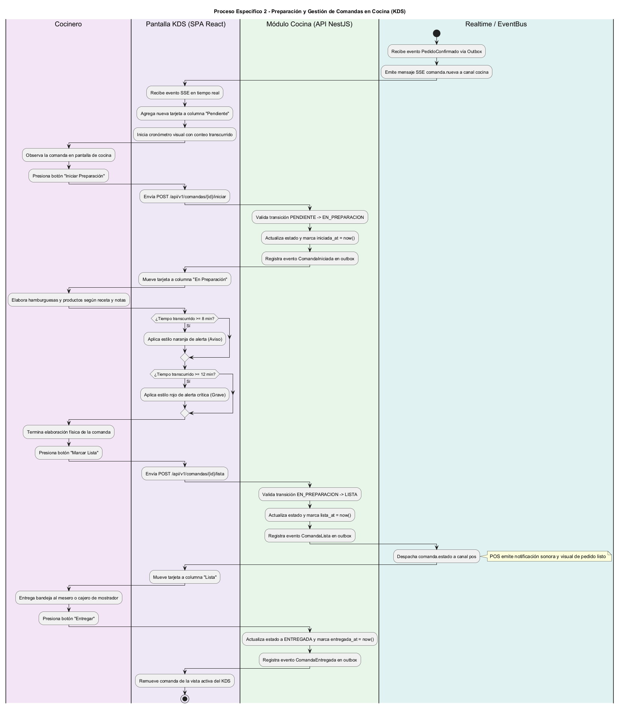  
*Figura 3. Diagrama de actividades: preparación y gestión de comandas en cocina KDS.*

#### Proceso Específico 3: Cobro de Cuenta y Arqueo de Caja
Este proceso describe cómo el cajero abre su turno de caja registrando la base inicial en efectivo, procesa el pago del pedido mediante efectivo, tarjeta o transferencia bancaria, calcula el cambio exacto y la propina voluntaria en mesas, genera el recibo correlativo POS, registra posibles ingresos o retiros manuales durante la jornada y efectúa el arqueo ciego al cierre de turno contrastando el efectivo contado contra el saldo esperado.

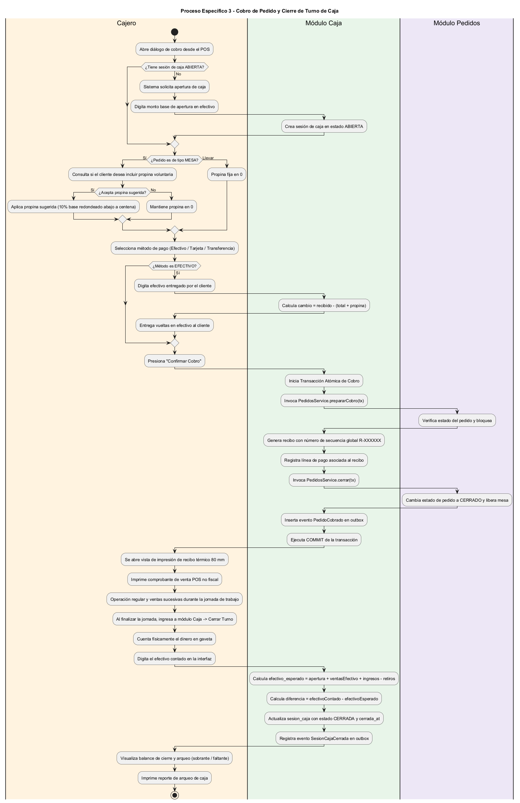  
*Figura 4. Diagrama de actividades: cobro de pedidos y arqueo/cierre de caja.*

---

### 1.2 Casos de Uso del Mundo Real

Los casos de uso del mundo real representan las interacciones esenciales entre los actores humanos del negocio y el sistema informático.

A continuación, se presentan los diagramas de casos de uso:

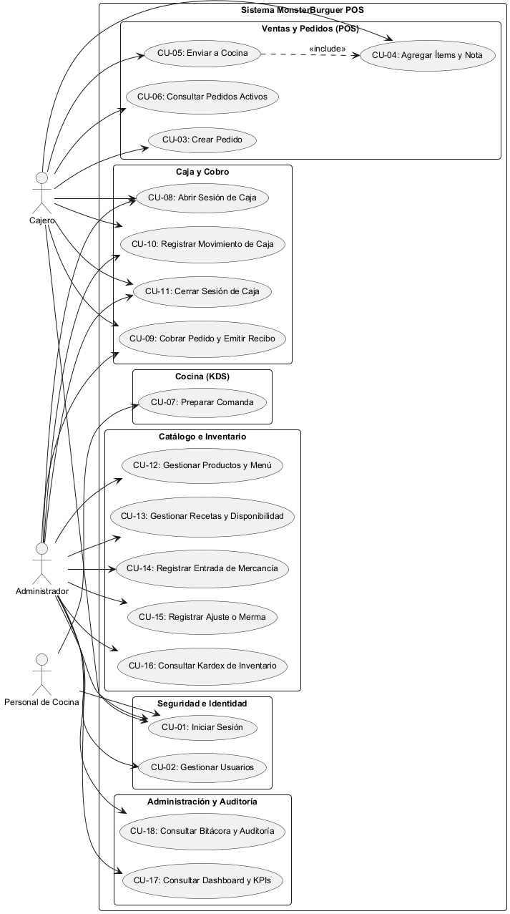  
*Figura 5. Diagrama general de casos de uso del sistema MonsterBurguer POS.*

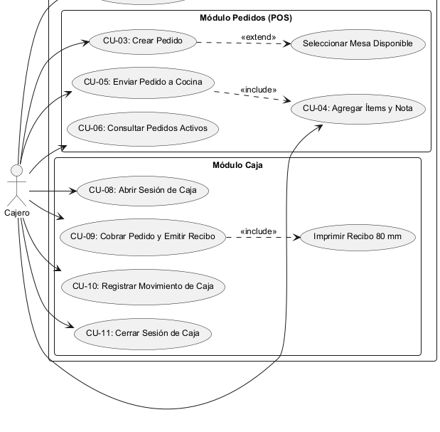  
*Figura 6. Diagrama de casos de uso para el rol Cajero.*

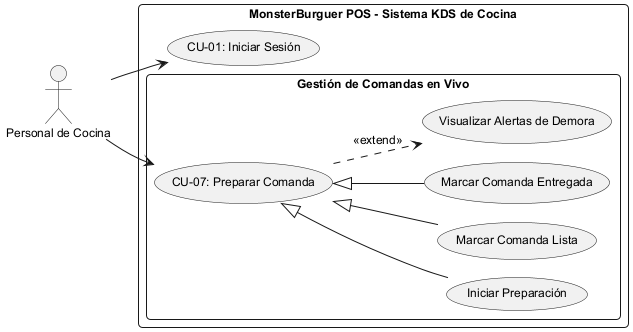  
*Figura 7. Diagrama de casos de uso para el rol Personal de Cocina (KDS).*

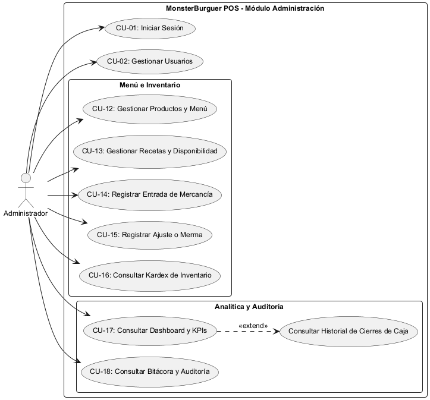  
*Figura 8. Diagrama de casos de uso para el rol Administrador.*

#### Descripción Resumida de Casos de Uso del Mundo Real

| Caso de Uso | Descripción | Actores | Precondiciones | Flujo Principal |
|---|---|---|---|---|
| **CU-01: Iniciar Sesión** | Identifica al empleado y otorga acceso a la interfaz según rol asignado (POS, KDS, Admin). | Empleado (Admin, Cajero, Cocina) | Usuario registrado y activo en el sistema. | 1. Empleado introduce credenciales. 2. Backend valida hash Argon2id y límite de tasa. 3. Sistema crea sesión opaca y emite cookie HttpOnly. 4. Redirige a ruta por rol. |
| **CU-02: Gestionar Usuarios** | Permite crear, modificar datos, cambiar rol y activar/desactivar empleados. | Administrador | Sesión activa de Administrador. | 1. Admin visualiza lista de personal. 2. Introduce nombres, usuario, clave (≥8 chars) y rol. 3. Sistema valida unicidad y persiste. |
| **CU-03: Crear Pedido** | Inicia un nuevo ticket para mesa o llevar, asignando consecutivo diario y fecha operativa. | Cajero | Sesión activa en POS. | 1. Cajero selecciona tipo de atención. 2. Si es mesa, pulsa mesa desocupada del plano. 3. Sistema crea pedido en estado ABIERTO. |
| **CU-04: Agregar Ítems y Nota** | Adiciona productos del menú al ticket, modifica cantidades e ingresa notas culinarias. | Cajero | Pedido en estado ABIERTO. | 1. Cajero toca producto activo. 2. Sistema copia snapshot de nombre y precio (COP). 3. Cajero ajusta cantidad o nota (máx. 140 chars). 4. Sistema recalcula total. |
| **CU-05: Enviar Pedido a Cocina** | Confirma el pedido, descuenta stock de ingredientes con receta y envía comanda a cocina. | Cajero | Pedido ABIERTO con ≥ 1 ítem y stock suficiente. | 1. Cajero pulsa Enviar a cocina. 2. Transacción bloquea ingredientes con FOR UPDATE. 3. Descuenta stock y registra kardex. 4. Inserta comanda y emite SSE. |
| **CU-06: Consultar Pedidos Activos** | Monitorea el estado de las órdenes del turno y permite recuperarlas para cobro. | Cajero | Pedidos en fecha operativa. | 1. Cajero abre pedidos activos. 2. Visualiza tiempos y estados de cocina. 3. Al pasar a LISTA, recibe toast. 4. Selecciona para cobrar. |
| **CU-07: Preparar Comanda** | Permite a cocina avanzar el ciclo de producción de órdenes (Pendiente → Preparación → Lista → Entregada). | Cocinero | Sesión activa en KDS. | 1. Cocina recibe tarjeta en vivo vía SSE. 2. Pulsa Iniciar (iniciada_at = now). 3. Pulsa Lista (lista_at = now). 4. Pulsa Entregar (entregada_at = now). |
| **CU-08: Abrir Sesión de Caja** | Habilita el turno de cobro registrando el fondo base de efectivo en gaveta. | Cajero, Admin | Usuario sin otra sesión abierta. | 1. Cajero accede a módulo Caja. 2. Digita monto inicial en efectivo (≥ 0). 3. Sistema crea sesión en estado ABIERTA. |
| **CU-09: Cobrar Pedido y Emitir Recibo** | Liquida la cuenta con un medio de pago, calcula propina y cambio, emite recibo y cierra pedido. | Cajero | Sesión de caja ABIERTA y pedido no cobrado. | 1. Abre diálogo de cobro. 2. Ingresa propina voluntaria si es mesa. 3. Elige medio de pago y digita recibido. 4. Transacción atómica emite recibo y cierra pedido. 5. Imprime recibo 80 mm. |
| **CU-10: Registrar Movimiento de Caja** | Asienta entradas o salidas manuales de efectivo en gaveta con motivo obligatorio. | Cajero, Admin | Sesión de caja ABIERTA. | 1. Selecciona nuevo movimiento. 2. Elige INGRESO o RETIRO. 3. Digita monto y motivo (3-140 chars). 4. Sistema valida que no deje saldo negativo y persiste. |
| **CU-11: Cerrar Sesión de Caja** | Realiza el arqueo ciego del turno registrando el conteo físico y calculando descuadres. | Cajero, Admin | Sesión de caja ABIERTA. | 1. Cajero selecciona Cerrar caja. 2. Cuenta dinero en gaveta y digita efectivo contado. 3. Sistema calcula esperado y diferencia. 4. Pasa a CERRADA e imprime balance. |
| **CU-12: Gestionar Productos y Categorías** | Administra la oferta del menú, organizando categorías y productos con precio final. | Administrador | Sesión activa de Administrador. | 1. Admin crea categoría con orden. 2. Registra producto con nombre único, descripción y precio COP. 3. Sistema persiste y actualiza POS. |
| **CU-13: Gestionar Recetas y Disponibilidad** | Enlaza productos con materias primas requeridas y supervisa platos agotados. | Administrador | Productos e ingredientes registrados. | 1. Admin selecciona plato y pulsa Editar Receta. 2. Asigna cantidades enteras en unidad base (G, ML, UND). 3. Sistema recalcula disponibilidad automática. |
| **CU-14: Registrar Entrada de Mercancía** | Registra compras de materias primas sumando existencias y desmarcando agotados. | Administrador | Ingredientes dados de alta. | 1. Admin selecciona insumo. 2. Digita cantidad recibida en unidad base y costo. 3. Sistema suma a stock_actual, genera kardex ENTRADA y repone menú. |
| **CU-15: Registrar Ajuste o Merma** | Asienta mermas por deterioro o correcciones tras conteo físico de inventario con motivo. | Administrador | Ingrediente activo. | 1. Admin elige MERMA o AJUSTE. 2. Selecciona insumo, digita cantidad y justificación obligatoria. 3. Sistema actualiza saldo y registra kardex. |
| **CU-16: Consultar Kardex de Inventario** | Audita el libro mayor cronológico de movimientos de cada ingrediente del restaurante. | Administrador | Movimientos de inventario existentes. | 1. Admin ingresa a pestaña Kardex. 2. Filtra por ingrediente. 3. Inspecciona fechas, tipos, cantidades, saldos resultantes y pedidos causantes. |
| **CU-17: Consultar Dashboard y KPIs** | Despliega indicadores de ventas, ticket promedio, tiempos de cocina, horas pico y alertas. | Administrador | Actividad en fecha operativa. | 1. Admin accede a /admin. 2. Sistema consulta vistas SQL v_ventas_dia, v_tiempos_cocina, v_stock_alertas. 3. Despliega gráficas y panel de alertas. |
| **CU-18: Consultar Bitácora y Auditoría** | Inspecciona la traza de eventos de dominio emitidos por el outbox entre subsistemas. | Administrador | Eventos en evento_sistema. | 1. Admin selecciona Bitácora de Interacciones. 2. Visualiza orden causal de eventos. 3. Abre detalle de payload JSON para verificar consistencia. |

---

### 1.3 Modelo de Dominio

El modelo de dominio representa los conceptos, relaciones y atributos esenciales del negocio que el sistema modela, abstrayéndose de cualquier librería o framework específico.

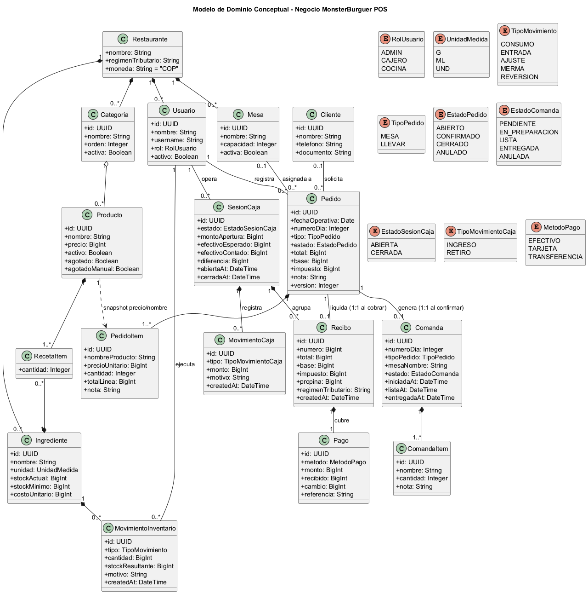  
*Figura 9. Diagrama de clases del modelo conceptual de dominio de MonsterBurguer POS.*

#### Entidades Clave del Dominio
- **Restaurante:** Representa la unidad de negocio global, configurando el régimen tributario (`NO_RESPONSABLE`), la moneda oficial (`COP`) y los parámetros operativos.
- **Usuario:** Empleado que interactúa con el sistema, caracterizado por su nombre, nombre de usuario único, rol operativo (`ADMIN`, `CAJERO`, `COCINA`) y estado de activación.
- **Mesa:** Ubicación física dentro del salón comedor con nombre identificador ("Mesa 1") y capacidad de comensales.
- **Cliente:** Persona natural o jurídica que consume en el establecimiento, registrada opcionalmente para efectos de fidelización y contacto.
- **Pedido:** Cabecera del ticket de compra. Articula la fecha operativa de negocio, el número consecutivo del día, el tipo (`MESA` o `LLEVAR`), el estado (`ABIERTO`, `CONFIRMADO`, `CERRADO`, `ANULADO`) y los importes monetarios en enteros COP (total, base gravable e impuesto).
- **PedidoItem:** Detalle de alimentos y bebidas solicitados. Almacena un snapshot inmutable del nombre del producto y su precio unitario al momento de ordenarlo, cantidad y nota culinaria.
- **Comanda:** Orden de trabajo destinada a la cocina (relación 1:1 con el pedido confirmado). Gestiona el número de orden, tipo y el ciclo de preparación (`PENDIENTE`, `EN_PREPARACION`, `LISTA`, `ENTREGADA`, `ANULADA`) con sus respectivas marcas de tiempo.
- **ComandaItem:** Línea de producción culinaria visible en la pantalla KDS que incluye nombre del plato, cantidad y notas de preparación.
- **Categoria:** Agrupación visual del menú ("Hamburguesas", "Bebidas", "Acompañamientos") con orden numérico para el terminal POS.
- **Producto:** Artículo terminado ofrecido en el menú comercial con precio final en COP, estado de activación y estado de disponibilidad (`agotado`).
- **RecetaItem:** Tabla asociativa que especifica la fórmula de escandallo: cantidad requerida de un ingrediente específico para confeccionar una unidad de producto.
- **Ingrediente:** Materia prima controlada en inventario, cuantificada en una unidad base entera (`G`, `ML`, `UND`), con stock actual, stock mínimo para alertas y costo unitario promedio.
- **MovimientoInventario:** Registro inmutable del kardex que almacena cada mutación de existencias (`CONSUMO`, `ENTRADA`, `AJUSTE`, `MERMA`, `REVERSION`), cantidad con signo, saldo resultante y justificación.
- **SesionCaja:** Turno operativo del cajero. Registra el saldo base de apertura, el efectivo esperado consolidado, el dinero físico contado al cierre, la diferencia resultante (sobrante o faltante) y las horas de apertura y clausura.
- **MovimientoCaja:** Flujo manual de efectivo dentro de una sesión de caja (`INGRESO` o `RETIRO`) con justificación obligatoria.
- **Recibo:** Comprobante interno de venta POS emitido tras el cobro. Contiene número correlativo global ascendente (`R-000001`), desglose financiero, snapshot de régimen tributario y leyenda legal obligatoria de documento no fiscal.
- **Pago:** Medio con el que se liquida el recibo (`EFECTIVO`, `TARJETA`, `TRANSFERENCIA`), con registro de dinero recibido y vueltas calculadas.
- **EventoSistema:** Registro del outbox transaccional y bitácora de auditoría que preserva la secuencia causal inmutable de todas las mutaciones relevantes ocurridas entre los módulos.

---

### 1.4 Glosario

| Término | Definición |
|---|---|
| **POS (Point of Sale)** | Sistema informático de punto de venta utilizado en el mostrador para registrar órdenes de clientes, gestionar tickets y liquidar cobros. |
| **KDS (Kitchen Display System)** | Sistema de visualización de cocina en monitor o televisor que reemplaza las comandas tradicionales de papel por tarjetas electrónicas actualizadas en tiempo real. |
| **Fecha Operativa** | Día contable y operacional del restaurante que comprende desde las 05:00 a.m. de un día calendario hasta las 04:59 a.m. del día siguiente (hora legal de Colombia `America/Bogota`), evitando que el corte de medianoche fracture los turnos de servicio nocturnos (RN-16). |
| **Monolito Modular** | Estilo arquitectónico donde todo el sistema reside y se despliega como un único artefacto de software pero está internamente particionado en módulos estrictamente desacoplados, comunicados mediante contratos explícitos. |
| **Transactional Outbox** | Patrón de diseño de software empresarial donde los eventos de dominio se insertan en una tabla relacional (`evento_sistema`) dentro de la misma transacción ACID de negocio, garantizando que solo se emitan si la mutación fue confirmada exitosamente en disco. |
| **Server-Sent Events (SSE)** | Protocolo unidireccional estandarizado sobre HTTP mediante el cual el servidor transmite eventos en tiempo real hacia los navegadores web clientes sin requerir sondeo constante (*polling*). |
| **Kardex** | Libro o registro auxiliar inmutable y cronológico de inventario donde se asientan todas las entradas, salidas y saldos físicos de cada materia prima. |
| **Arqueo Ciego de Caja** | Procedimiento de control interno donde el cajero debe contar y digitar el dinero físico existente en la gaveta sin conocer previamente la cifra calculada por el sistema, garantizando la honestidad del balance. |
| **Bloqueo Pesimista (FOR UPDATE)** | Mecanismo de base de datos relacional que bloquea filas en lectura para impedir que transacciones concurrentes las modifiquen simultáneamente, previniendo sobreventas o inventario negativo. |
| **Escandallo / Receta** | Desglose cuantitativo exacto de los ingredientes necesarios para elaborar una porción o unidad de un producto gastronómico. |

---

## 2. Requisitos

A continuación se presentan los requisitos funcionales y no funcionales del sistema, priorizados mediante el método **MoSCoW** (*Must Have*, *Should Have*, *Could Have*, *Won't Have*) y enlazados a sus correspondientes casos de uso y reglas de negocio.

| ID Requisito | Tipo | Descripción | Prioridad (MoSCoW) | Casos de Uso Asociados |
|---|---|---|:---:|---|
| **RF-01** | Funcional | Autenticar usuarios con credenciales y establecer sesiones opacas seguras en base de datos con redirección por rol. | **Must Have** | CU-01 |
| **RF-02** | Funcional | Gestionar cuentas de empleados (crear, editar, activar/desactivar) y asignación de roles RBAC (Admin, Cajero, Cocina). | **Must Have** | CU-02 |
| **RF-03** | Funcional | Iniciar pedidos de venta asignando mesa libre o modalidad para llevar, con consecutivo diario y fecha operativa. | **Must Have** | CU-03 |
| **RF-04** | Funcional | Armar líneas de ticket copiando snapshot inmutable de precios y nombres, permitiendo notas culinarias por ítem. | **Must Have** | CU-04 |
| **RF-05** | Funcional | Confirmar pedidos descontando stock de recetas con bloqueo atómico FOR UPDATE y generando comanda KDS en la misma transacción. | **Must Have** | CU-05 |
| **RF-06** | Funcional | Visualizar y recuperar pedidos activos (abiertos y confirmados) con estados de cocina actualizados en tiempo real. | **Must Have** | CU-06 |
| **RF-07** | Funcional | Administrar el avance del ciclo de preparación de comandas en KDS (Pendiente, Preparación, Lista, Entregada) con alertas de tiempo. | **Must Have** | CU-07 |
| **RF-08** | Funcional | Registrar apertura de sesión de caja con fondo base en efectivo, restringiendo a una sesión activa por cajero. | **Must Have** | CU-08 |
| **RF-09** | Funcional | Cobrar pedidos en un único medio de pago, liquidar propina voluntaria en mesas, calcular cambio y emitir recibo no fiscal de 80 mm. | **Must Have** | CU-09 |
| **RF-10** | Funcional | Registrar ingresos y retiros manuales de efectivo en gaveta con motivo obligatorio y prevención de saldo negativo. | **Must Have** | CU-10 |
| **RF-11** | Funcional | Realizar cierre de caja con arqueo ciego, calculando el efectivo esperado y la diferencia (sobrante o faltante). | **Must Have** | CU-11 |
| **RF-12** | Funcional | Gestionar categorías y productos del menú con precio final al consumidor en pesos COP (Ley 1480 de 2011). | **Must Have** | CU-12 |
| **RF-13** | Funcional | Configurar recetas de ingredientes en unidades base y reevaluar automáticamente el estado de agotado del producto. | **Must Have** | CU-13 |
| **RF-14** | Funcional | Registrar compras y entradas de mercancía sumando stock al kardex y reponiendo productos del menú agotados. | **Must Have** | CU-14 |
| **RF-15** | Funcional | Registrar mermas de insumos deteriorados y ajustes físicos de inventario justificando obligatoriamente el motivo. | **Must Have** | CU-15 |
| **RF-16** | Funcional | Consultar el libro mayor o kardex de inventario con saldo resultante por movimiento y referencia al pedido causante. | **Must Have** | CU-16 |
| **RF-17** | Funcional | Visualizar dashboard administrativo en tiempo real con ventas del día, ticket promedio, tiempos de cocina y alertas de stock. | **Must Have** | CU-17 |
| **RF-18** | Funcional | Auditar la bitácora de eventos de dominio generados por el outbox transaccional para verificar la sincronía sistémica. | **Must Have** | CU-18 |
| **RNF-01** | No Funcional | Rendimiento de la API: latencia p95 < 200 ms en operaciones de mostrador bajo concurrencia local. | **Must Have** | Transversal |
| **RNF-02** | No Funcional | Latencia de propagación de eventos en tiempo real: confirmación en POS → visualización en KDS en ≤ 2 segundos. | **Must Have** | CU-05, CU-07 |
| **RNF-03** | No Funcional | Autonomía en red local: operación ininterrumpida dentro de la LAN sin requerir internet para la operativa diaria. | **Must Have** | Transversal |
| **RNF-04** | No Funcional | Manejo financiero estricto: cero uso de números de punto flotante para dinero; cálculos exclusivos en enteros COP. | **Must Have** | CU-04, CU-09, CU-11 |
| **RNF-05** | No Funcional | Seguridad de contraseñas y sesiones: hash Argon2id, tokens aleatorios de 256 bits y protección contra ataques CSRF y fuerza bruta. | **Must Have** | CU-01, CU-02 |
| **RNF-06** | No Funcional | Usabilidad y diseño táctil: objetivos táctiles ≥ 48 px, cobro de combo en ≤ 4 toques y legibilidad de KDS a 2 metros. | **Must Have** | CU-04, CU-07, CU-09 |
| **RNF-07** | No Funcional | Modularidad y bajo acoplamiento: fronteras verificadas por `dependency-cruiser` sin importaciones cruzadas de internals. | **Must Have** | Transversal |
| **RNF-08** | No Funcional | Accesibilidad web: cumplimiento de directrices WCAG 2.2 nivel AA en interfaces POS y Administración. | **Should Have** | Transversal |

> **Nota Metodológica:** La especificación pormenorizada y formal de los requisitos del software, elaborada conforme al estándar internacional **ISO/IEC/IEEE 29148**, se encuentra desarrollada en el documento anexo correspondiente: `Especificacion de Requisitos - MonsterBurguer.docx`.

---

## 3. Modelo de Diseño

Esta sección detalla el diseño del sistema a través de las Vistas 4+1 de Kruchten, justificando las decisiones de ingeniería adoptadas y evidenciando la aplicación de patrones arquitectónicos y de diseño orientado a objetos.

### 3.1 Vista de Escenarios

La Vista de Escenarios une y valida las restantes cuatro vistas desde la perspectiva del usuario final.

#### 3.1.1 Casos de Uso de Diseño

Los casos de uso de diseño refinan los casos de uso esenciales del negocio, describiendo la interacción técnica paso a paso entre el actor, la interfaz de usuario, los controladores de la API, los servicios de dominio y la base de datos relacional.

##### D-CU-05: Confirmar Pedido y Enviar a Cocina

| Paso | Actor | Sistema | Detalle |
|:---:|---|---|---|
| 1 | Cajero | | Pulsa el botón "Enviar a cocina" en la pantalla del POS. |
| 2 | | Sistema (Web POS) | Valida que el ticket contenga al menos una línea y deshabilita el botón para evitar doble envío. |
| 3 | | Sistema (Web POS) | Despacha petición HTTP `POST /api/v1/pedidos/{id}/confirmar` incluyendo cookie de sesión. |
| 4 | | Sistema (API NestJS) | `OrigenGuard` y `SesionGuard` validan autenticación y pertenencia de la solicitud. |
| 5 | | Sistema (API NestJS) | `PedidosController` delega la ejecución en `PedidosService.confirmarBloqueado(id, usuarioId)`. |
| 6 | | Sistema (API NestJS) | `PedidosService` abre una transacción ACID (`tx`) en PostgreSQL. |
| 7 | | Sistema (API NestJS) | Bloquea el pedido en la base de datos mediante `SELECT ... FOR UPDATE`. |
| 8 | | Sistema (API NestJS) | Invoca a `InventarioPublicService.consumir(tx, items, ...)`. |
| 9 | | Sistema (API NestJS) | `InventarioService` ejecuta `SELECT ... FOR UPDATE` sobre la tabla `ingrediente` ordenando por `id ASC`. |
| 10 | | Sistema (API NestJS) | Verifica que `stock_actual >= requerido`. Descuenta las cantidades e inserta filas en `movimiento_inventario` (`CONSUMO`). |
| 11 | | Sistema (API NestJS) | Invoca a `CocinaPublicService.crearComanda(tx, datosComanda)`. |
| 12 | | Sistema (API NestJS) | `CocinaService` inserta la comanda en estado `PENDIENTE` y sus correspondientes `comanda_item`. |
| 13 | | Sistema (API NestJS) | Actualiza el estado del pedido a `CONFIRMADO` y registra `confirmado_at = now()`. |
| 14 | | Sistema (API NestJS) | `EventBus.publicarEnTx` inserta la fila del evento `PedidoConfirmado` en la tabla `evento_sistema`. |
| 15 | | Sistema (API NestJS) | Ejecuta `COMMIT` de la transacción. PostgreSQL emite `NOTIFY evento_sistema`. |
| 16 | | Sistema (API NestJS) | `OutboxDispatcher` despierta, toma el evento y ejecuta los *handlers* post-commit. |
| 17 | | Sistema (API NestJS) | `RealtimeService` despacha el evento SSE `comanda.nueva` a la pantalla KDS. |
| 18 | | Sistema (Web POS) | Recibe respuesta HTTP 200 con número del día y actualiza el ticket a modo lectura. |
| 19 | Cocinero | | Visualiza la nueva tarjeta de orden en la columna "Pendiente" del KDS con alerta sonora. |

##### D-CU-09: Cobrar Pedido y Liquidar Recibo

| Paso | Actor | Sistema | Detalle |
|:---:|---|---|---|
| 1 | Cajero | | Presiona el botón "Cobrar" en el ticket del POS. |
| 2 | | Sistema (Web POS) | Abre el modal accesible de cobro; si el pedido es de mesa, consulta propina voluntaria sugerida (10 %). |
| 3 | Cajero | | Selecciona medio de pago (Efectivo) y digita el monto recibido en pesos. |
| 4 | | Sistema (Web POS) | Calcula el cambio en tiempo real y habilita el botón "Confirmar Cobro". |
| 5 | Cajero | | Presiona "Confirmar Cobro". |
| 6 | | Sistema (Web POS) | Envía petición HTTP `POST /api/v1/caja/cobros` con el payload de liquidación. |
| 7 | | Sistema (API NestJS) | `CajaController` recibe la solicitud y delega en `CajaService.cobrar(usuarioId, cobroDto)`. |
| 8 | | Sistema (API NestJS) | Inicia transacción ACID (`tx`) y valida que el cajero posea una `sesion_caja` en estado `ABIERTA`. |
| 9 | | Sistema (API NestJS) | Llama a `PedidosPublicService.prepararCobro(tx, pedidoId)` para verificar y bloquear el pedido. |
| 10 | | Sistema (API NestJS) | Inserta registro en `recibo` consumiendo el siguiente consecutivo de la secuencia `recibo_numero_seq`. |
| 11 | | Sistema (API NestJS) | Inserta registro en `pago` con método, recibido y cambio. |
| 12 | | Sistema (API NestJS) | Llama a `PedidosPublicService.cerrar(tx, pedidoId)` pasando el pedido a `CERRADO` y liberando la mesa. |
| 13 | | Sistema (API NestJS) | `EventBus.publicarEnTx` persiste el evento `PedidoCobrado` en el outbox y ejecuta `COMMIT`. |
| 14 | | Sistema (API NestJS) | Retorna respuesta HTTP 201 con ID de recibo, número y cambio. |
| 15 | | Sistema (Web POS) | Muestra pantalla de cambio en grande y dispara diálogo de impresión térmica a 80 mm. |

#### 3.1.2 Diseño de Interfaz Gráfica de Usuario

El diseño de la interfaz gráfica fue elaborado aplicando rigurosamente los principios de diseño de experiencia e interfaces de usuario (UI/UX) compilados en `DESIGN.md`:
1. **Velocidad sobre adorno:** En momentos de alta demanda (hora pico), un cajero debe registrar y cobrar una orden en **≤ 4 toques**. Cada pantalla posee una acción primaria claramente diferenciada.
2. **Filosofía táctil primero (*Touch-First*):** Todos los botones y tarjetas interactivas cuentan con dimensiones de al menos 48 × 48 px (los botones de productos en el POS son de 96 a 120 px de alto), con separación mínima de 8 px para evitar toques accidentales, eliminando cualquier interacción dependiente de eventos *hover*.
3. **El color nunca va solo:** Siguiendo directrices de accesibilidad (WCAG 2.2 AA), ningún estado (listo, atrasado, agotado, error) se comunica únicamente mediante color; todos se acompañan de **icono semántico de Lucide + texto explicativo**.
4. **Legibilidad a distancia en Cocina:** La pantalla KDS utiliza fondo oscuro (`#0C0A09`), números de comanda de 48 a 64 px y texto de ítems de 20 a 24 px para garantizar legibilidad nítida a 2 metros de distancia bajo la iluminación de la cocina.
5. **Cifras tabulares:** Precios, totales, cantidades y cronómetros emplean `font-variant-numeric: tabular-nums` para evitar oscilaciones de layout durante las actualizaciones numéricas en vivo.

---

### 3.2 Vista Lógica

La Vista Lógica se centra en la organización interna del software a nivel de abstracciones, clases, patrones y modularización.

#### 3.2.1 Arquitectura del Sistema
La arquitectura adoptada es un **Monolito Modular** construido sobre NestJS 12 y TypeScript. Se seleccionó este estilo para garantizar máxima cohesión dentro de cada subsistema gastronómico y bajo acoplamiento entre ellos, manteniendo la simplicidad operativa de un único artefacto desplegable en el servidor del restaurante.

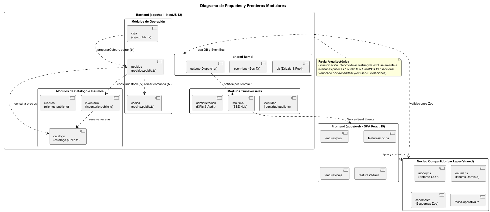  
*Figura 10. Diagrama de paquetes arquitectónicos y reglas de dependencia en el backend.*

Para satisfacer los requisitos no funcionales, se implementaron los siguientes patrones arquitectónicos:
- **Patrón Fachada Pública (`*.public.ts`):** Cada módulo exporta un servicio público que define formalmente las únicas operaciones que otros módulos pueden invocar. Las dependencias internas de controladores, repositorios y esquemas privados están selladas.
- **Patrón Transactional Outbox:** Utilizado en el núcleo compartido (`shared-kernel`) a través de la tabla `evento_sistema` para resolver el problema de la doble escritura (*dual write*). Toda mutación de estado y su correspondiente evento de dominio ocurren bajo la misma transacción relacional ACID.
- **Patrón Repository:** Utilizado en cada módulo para aislar las consultas y mutaciones de base de datos ejecutadas con Drizzle ORM de la lógica de negocio pura de los servicios.

#### 3.2.2 Diseño del Sistema
A continuación, se presenta el diagrama de clases de diseño y la máquina de estados de las entidades primordiales del sistema:

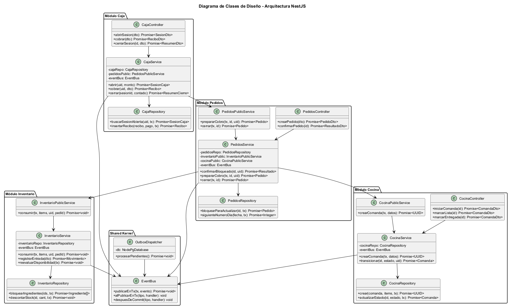  
*Figura 11. Diagrama de clases de diseño del backend NestJS.*

##### Máquinas de Estados del Dominio

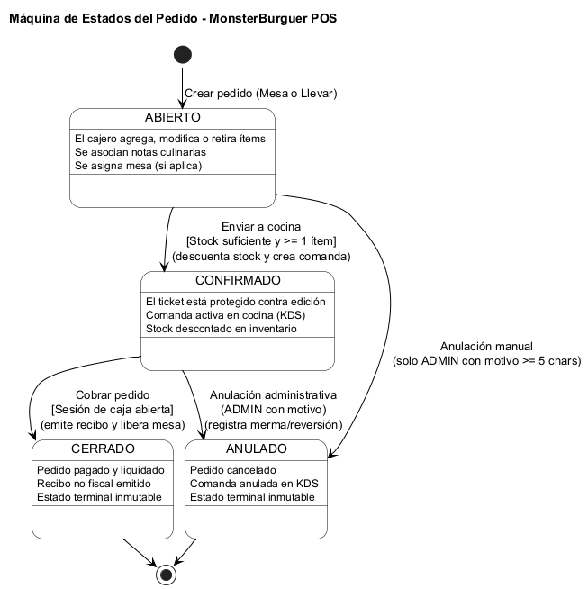  
*Figura 12. Diagrama de estados de la entidad Pedido.*

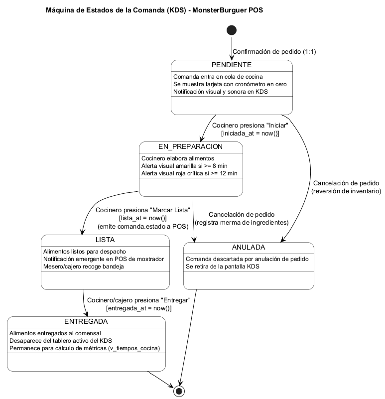  
*Figura 13. Diagrama de estados de la entidad Comanda en cocina.*

##### Matriz de Clases, Responsabilidades y Patrones

| Clase / Componente | Responsabilidad Principal | Patrones de Diseño Usados |
|---|---|---|
| `PedidosService` | Coordina la lógica de negocio de apertura de tickets, agregado de líneas con snapshot inmutable y confirmación transaccional. | *Domain Service*, *Orchestrator*, *Facade* |
| `PedidosRepository` | Abstrae las operaciones SQL sobre las tablas `pedido`, `pedido_item` y `contador_dia`. | *Repository Pattern* |
| `InventarioService` | Ejecuta el consumo atómico de ingredientes por receta aplicando bloqueo pesimista ordenado, y administra el kardex. | *Domain Service*, *Pessimistic Locking* |
| `CocinaService` | Modela la máquina de estados de las comandas y computa las marcas de tiempo para el cálculo de tiempos de cocina. | *State Pattern*, *Domain Service* |
| `CajaService` | Gobierna la apertura/cierre de turnos de cobro, la liquidación atómica de recibos con medios de pago y el arqueo. | *Domain Service*, *Transaction Script* |
| `EventBus` | Publica eventos dentro de transacciones SQL activas y gestiona los despachadores locales post-commit. | *Event-Driven Architecture*, *Observer* |
| `OutboxDispatcher` | Monitorea la tabla `evento_sistema` mediante `LISTEN/NOTIFY` y sondeo periódico de respaldo para garantizar entrega al menos una vez (*At-Least-Once Delivery*). | *Polling Consumer*, *Transactional Outbox* |
| `RealtimeService` | Mantiene el hub de conexiones activas Server-Sent Events (SSE) y distribuye los mensajes a los canales correspondientes (`pos`, `cocina`, `admin`). | *Publish-Subscribe*, *Gateway* |

---

### 3.3 Vista de Procesos

La Vista de Procesos se enfoca en el comportamiento dinámico, la concurrencia y la interacción temporal entre componentes del sistema.

#### Diagrama de Secuencia: Confirmación Atómica de Pedido
Ilustra la colaboración síncrona entre módulos pasando la misma transacción relacional `tx`, el bloqueo ordenado de ingredientes para prevenir *deadlocks*, y la propagación post-commit al hub de eventos en tiempo real.

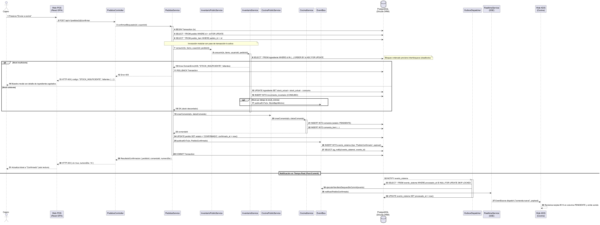  
*Figura 14. Diagrama de secuencia: confirmación atómica de pedido, reserva de inventario y creación de comanda.*

#### Diagrama de Secuencia: Cobro y Cierre de Cuenta
Ilustra el proceso atómico de liquidación financiera, validación de la sesión de caja del cajero, generación de consecutivo de recibo mediante secuencia PostgreSQL, cierre formal del pedido y despacho de eventos para liberación de mesas y actualización de KPIs.

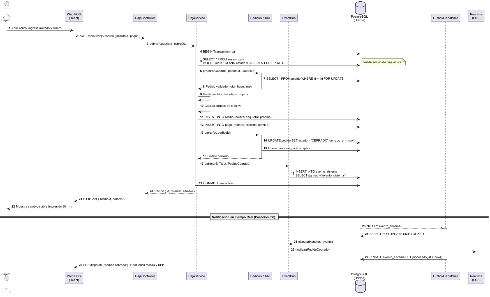  
*Figura 15. Diagrama de secuencia: cobro de pedido, emisión de recibo y cierre de cuenta.*

---

## 4. Modelo de Implementación

Esta sección explica y fundamenta las decisiones tecnológicas adoptadas para el desarrollo y despliegue del sistema MonsterBurguer POS.

### 4.1 Vista de Desarrollo

Las decisiones tecnológicas se fundamentaron en criterios de madurez del ecosistema, seguridad tipada de punta a punta (*end-to-end type safety*), desempeño en tiempo de ejecución y velocidad de desarrollo:

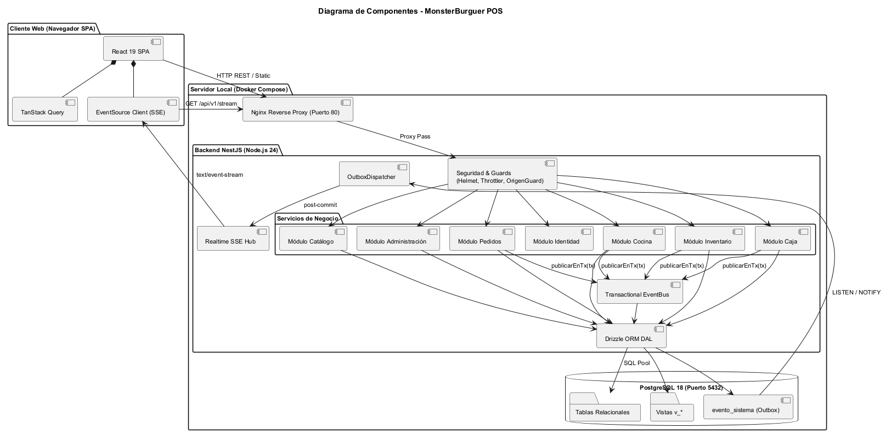  
*Figura 16. Diagrama de componentes del sistema MonsterBurguer POS.*

#### Matriz de Tecnologías de Desarrollo

| Componente | Tecnología Seleccionada | Justificación | Modelo de Desarrollo |
|---|---|---|---|
| **Lenguaje de Programación** | TypeScript 5.8 | Tipado estático en frontend y backend; contratos compartidos en `@mb/shared` que eliminan desajustes de API en tiempo de compilación. | Orientado a Objetos / Funcional |
| **Framework Backend** | NestJS 12 sobre Node.js 24 | Inyección de dependencias robusta, soporte nativo para modularidad, guards de seguridad y arquitectura empresarial limpia. | Monolito Modular / MVC |
| **Librería Frontend** | React 19 + Vite 8 | Renderizado reactivo de alto rendimiento, recarga rápida en desarrollo (*HMR*) y ecosistema moderno de hooks para gestión de estado. | Componentes Funcionales / SPA |
| **Estilos y Componentes UI** | Tailwind CSS v4 + shadcn/ui | Sistema de diseño basado en tokens semánticos CSS, accesibilidad integrada (Radix UI) y control estricto de estilos táctiles. | Utility-First / Atomic Design |
| **Capa de Acceso a Datos** | Drizzle ORM | ORM liviano con tipado TypeScript estricto, cero sobrecarga en tiempo de ejecución y soporte nativo para transacciones y migraciones SQL. | Data Mapper / Type-Safe SQL |
| **Validación de Esquemas** | Zod | Validación declarativa de esquemas de entrada y reglas de negocio, compartida entre cliente y servidor. | Schema-Driven Development |
| **Verificación de Fronteras** | dependency-cruiser | Herramienta de análisis estático configurada en CI que prohíbe importaciones directas de archivos internos entre módulos de NestJS. | Reglas de Arquitectura Estática |

---

### 4.2 Vista Física (Despliegue)

La arquitectura física de despliegue está diseñada para operar con absoluta autonomía y resiliencia en la **Red de Área Local (LAN)** del restaurante, garantizando que una caída del servicio de internet no interrumpa las ventas ni la comunicación con la cocina.

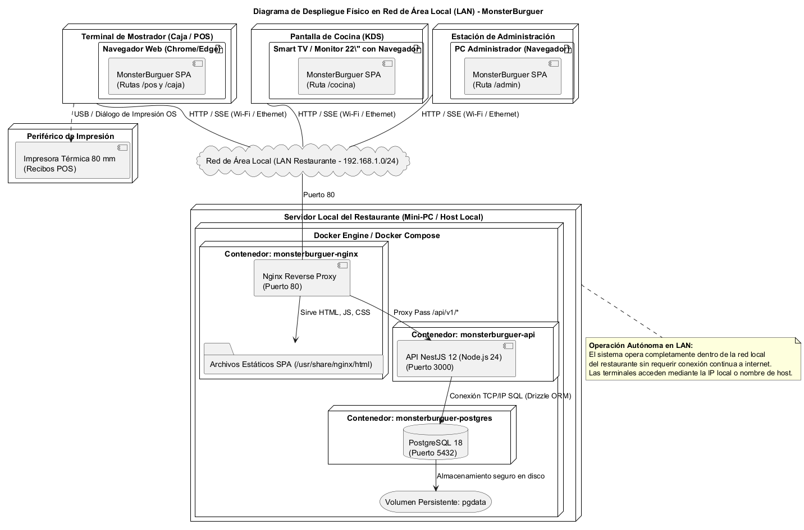  
*Figura 17. Diagrama de despliegue físico del sistema en la red de área local del restaurante.*

#### Matriz de Infraestructura y Despliegue

| Entorno / Nodo | Tecnología / Servicio | Justificación | Modelo Físico |
|---|---|---|---|
| **Servidor Local del Restaurante** | Mini-PC o Host Local ejecutando Docker Engine y Docker Compose | Aislamiento completo de procesos, portabilidad garantizada y configuración unificada mediante `docker-compose.yml`. | Nodo de Cómputo Central |
| **Servidor Web y Proxy Inverso** | Contenedor Nginx (puerto 80) | Distribución eficiente de los archivos estáticos de la SPA (HTML/JS/CSS) y redirección (*reverse proxy*) de llamadas `/api/v1/*` hacia la API. | Contenedor de Frontera |
| **Servidor de Aplicaciones** | Contenedor NestJS (Node.js 24 en puerto 3000 interno) | Ejecución de la lógica de negocio, despacho de endpoints REST y emisión del flujo SSE en `/api/v1/stream`. | Contenedor de Negocio |
| **Motor de Base de Datos** | Contenedor PostgreSQL 18 (puerto 5432 interno) | Persistencia ACID confiable con almacenamiento en volumen Docker dedicado (`pgdata`), soporte para bloqueos `FOR UPDATE` y `LISTEN/NOTIFY`. | Contenedor de Base de Datos |
| **Terminales de Mostrador (Caja/POS)** | Tablet 10–13" o PC táctil con navegador Chrome/Edge | Acceso web a la ruta `/pos` y `/caja` dentro de la subred local (192.168.1.X). | Dispositivo Cliente Táctil |
| **Terminal de Cocina (KDS)** | Pantalla o Smart TV 22"+ con navegador web | Acceso web a la ruta `/cocina` para recepción continua de comandas en vivo vía SSE. | Dispositivo Cliente de Pantalla |
| **Periférico de Impresión** | Impresora térmica estándar de 80 mm | Conexión USB o Ethernet con el terminal de mostrador; invocación nativa mediante diálogo `@media print`. | Periférico de Salida |

---

## 5. Anexos

Los siguientes documentos y recursos complementarios forman parte integral del soporte de ingeniería de este Manual del Sistema:
1. **Documento de Especificación de Requisitos:** Formulado bajo la norma ISO/IEC/IEEE 29148 (`Especificacion de Requisitos - MonsterBurguer.docx`).
2. **Manual de Usuario:** Guía operativa ilustrada de navegación y solución de problemas (`Manual de Usuario - MonsterBurguer.docx`).
3. **Fichas Detalladas de Casos de Uso:** Libro Excel con las 18 fichas normalizadas de casos de uso (`Casos de Uso - MonsterBurguer.xlsx`).
4. **Proyecto y Diagramas UML:** Modelos PlantUML y diagramas exportados a formato PNG (`docs/entregables-isoft/uml/`).
5. **Script de Base de Datos y Migraciones Drizzle:** Ubicado en `apps/api/drizzle/` con el historial de migraciones SQL `0000` a `0004`.
6. **Reportes de Verificación y Calidad:** Informes de pruebas automatizadas y auditoría E2E (`docs/verificacion/reporte-qa-2026-10-07.md`).
7. **Credenciales de Demostración:** Archivo de texto con las cuentas de demostración preconfiguradas (`usuarios-y-claves.txt`).
